# SENG 326 — Software Architecture
## Task 2

KARIM HARIRI – 22050941008
MOHAMED ATTIA EID ATTIA EID – 22050941017
ZAID HARDAN – 22050941005

Group: **THE GROUP**
Target architecture (per group registration): **Pipe-and-Filter Architecture**


## Executive Summary

This is our Task 2 write-up for SENG 326. The assignment was to take a small slice of Checkstyle 13.2.0 and refactor it into the architectural style our group registered for. We registered Pipe-and-Filter, so that is the only style used inside the slice. Where the example report or the original codebase used other styles we mention them by name when a comparison helps, and otherwise leave them alone.

The slice itself was fixed for everybody: every check in the Metrics category and every check in the Size Violations category — six metric checks (plus one shared abstract base class), ten size checks, sixteen concrete checks in total.

By the end of the migration the refactored jar produced byte-for-byte identical output to the original on the same inputs, the full Maven test suite still passed for every test that was not blocked by a host-environment issue (JDK 25 + Mockito incompatibility, headless GUI), ten ArchUnit rules confirmed the pipeline shape in the compiled bytecode, five jQAssistant queries confirmed the same shape from the dependency graph, and the per-file processing time stayed within timing noise of the original on every benchmark project we measured.

Inside the slice, each check is now a small pipeline of independent filters wired together by typed pipes. The outer class that Checkstyle's `TreeWalker` still sees has been cut down to a thin Pipeline Driver — its only job is to translate framework callbacks into pipeline messages and forward whatever violations come back out the tail. Measurement, threshold comparison, and violation emission used to share one method body in the original check; they are now three separate filter classes, each with a single responsibility.


## Contents

1. Background: What Is Checkstyle?
2. What Is Pipe-and-Filter Architecture?
3. The 16 Checks We Refactored
4. The New Infrastructure Classes
5. How We Did the Refactoring (Step by Step)
6. Complete Class Mapping (All 16 Checks)
7. Verification: Proving It Still Works
8. Hard Constraints We Had to Meet
9. Lessons Learned
10. Part B: Performance Experiment
11. Glossary of Terms
12. References
13. Appendix


# Section 1  Background: What Is Checkstyle?

## 1.1  What Checkstyle Does

Checkstyle is a free, open-source Java tool that checks Java source code for style violations. A "style violation" is something a team has agreed is bad: a method that is too long, a class that pulls in too many other classes, a line wider than 80 characters, a method whose cyclomatic complexity is over 10, and so on.

Checkstyle ships with around 200 built-in rules (called "checks"). Teams choose which ones to use and configure them in an XML file. Google publishes `google_checks.xml` for the Google style guide; Checkstyle bundles that file as a built-in example.

When you run Checkstyle on a Java project, it:

1. reads every `.java` file;
2. parses each file into an Abstract Syntax Tree (AST);
3. walks the tree, visiting each node, and invokes every registered check on it;
4. collects the violations and writes them to the console or a file.

## 1.2  What Is an Abstract Syntax Tree (AST)?

When a parser reads source code, it produces a tree-shaped data structure called an Abstract Syntax Tree. A Java `if` statement like `if (x > 0) { return x; }` becomes a tree with an `IF` node at the top and children for the condition and the body.

Checkstyle uses this tree so that checks do not have to read the raw text. A check that wants to measure how long a method is can ask for `METHOD_DEF` nodes and count the lines between the opening and closing brace, and not match strings.

## 1.3  Checkstyle's Original Architecture

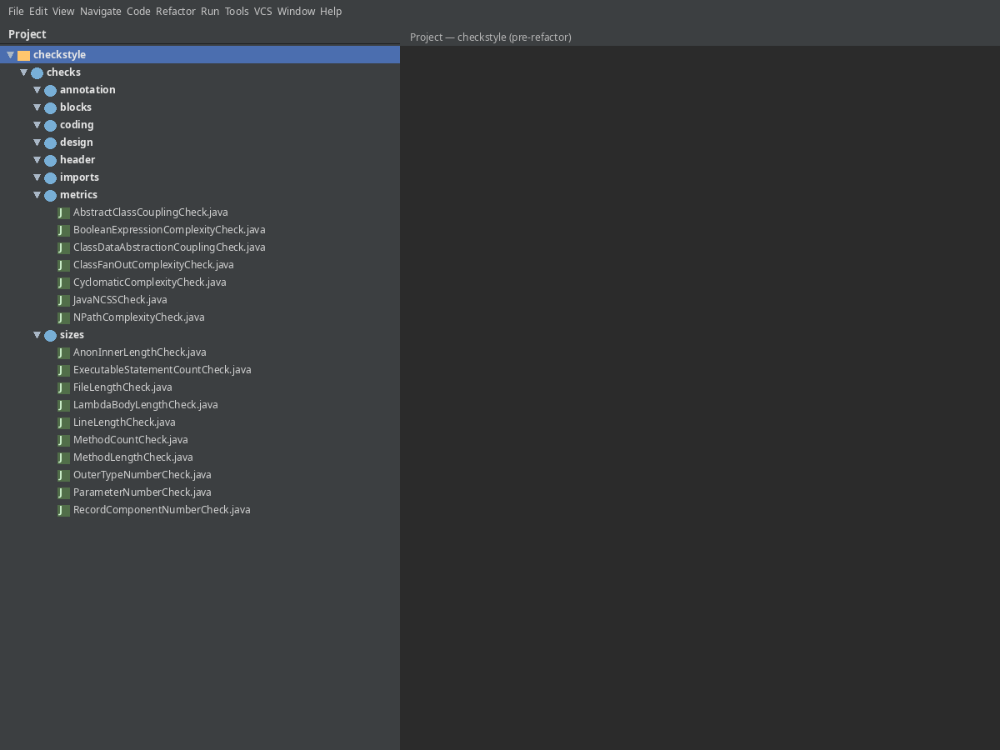

*Figure: IDE Project view of the pre-refactor checkstyle/checks tree — metrics/ and sizes/ packages hold all sixteen monolithic drivers.*

Checkstyle's original design is a Plug-in Framework. A central engine called `TreeWalker` parses each file and walks the tree. As it walks, it calls `visitToken()` and `leaveToken()` on every check that registered for the current token type. Each check class extends the base class `AbstractCheck`. When a check finds a violation, it calls the `log()` method that it inherited from `AbstractCheck`.

This is simple, and it works, but every check ends up doing too many jobs at once. A typical check class contains:

- the lifecycle handling for `TreeWalker` callbacks;
- the actual measurement (counting branches, counting lines, counting types);
- the threshold check;
- the violation reporting.

All four jobs sit in one class. There is no clear stage boundary, no place where you can replace or test the measurement on its own, and no protection against shared state leaking between concerns.

## 1.4  The Two Check Categories We Worked With

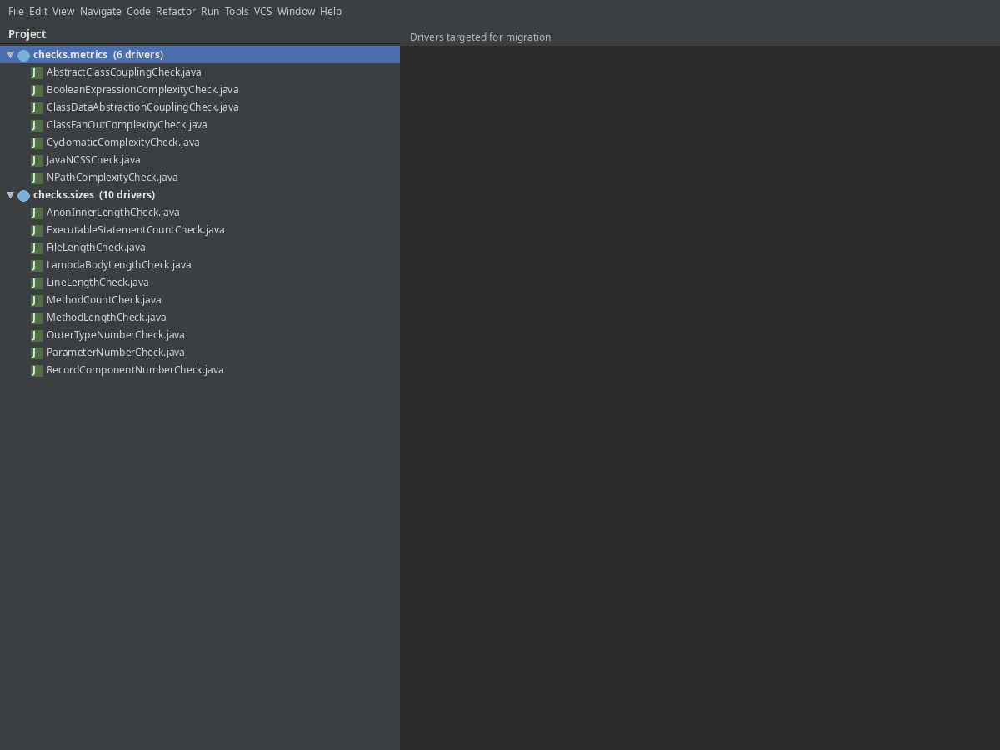

*Figure: The sixteen driver files we migrated, split across checks.metrics (6) and checks.sizes (10).*

Our refactoring scope was set by the assignment: all checks under the Metrics and Size Violations categories.

**Metrics checks** (6 concrete + 1 shared abstract base):

- `BooleanExpressionComplexityCheck`
- `ClassDataAbstractionCouplingCheck`
- `ClassFanOutComplexityCheck`
- `CyclomaticComplexityCheck`
- `JavaNCSSCheck`
- `NPathComplexityCheck`

The shared abstract base is `AbstractClassCouplingCheck`. It is not registered as a Checkstyle module on its own; it provides the type-resolution helpers that the two coupling checks use.

**Sizes checks** (10 concrete):

- `AnonInnerLengthCheck`
- `ExecutableStatementCountCheck`
- `FileLengthCheck`
- `LambdaBodyLengthCheck`
- `LineLengthCheck`
- `MethodCountCheck`
- `MethodLengthCheck`
- `OuterTypeNumberCheck`
- `ParameterNumberCheck`
- `RecordComponentNumberCheck`

Two of the size checks are different from the rest. `LineLengthCheck` and `FileLengthCheck` do not work on the AST. They work on the raw text of the file, and they extend `AbstractFileSetCheck` instead of `AbstractCheck`. We treat them as a separate sub-pipeline shape later in Section 2.

Before the refactoring, every one of the sixteen checks mixed the four jobs from §1.3 together inside one class. The next section explains how we split those jobs into independent stages connected by pipes.


# Section 2  What Is Pipe-and-Filter Architecture?

## 2.1  The Core Idea

Pipe-and-Filter goes back to the early days of Unix. Each command in a shell pipeline does exactly one thing, reads from its standard input, writes to its standard output, and is completely unaware of whatever sits on either side of it. The `|` between commands is the pipe.

The same vocabulary carries over to a software pipeline: a **filter** is an independent processing stage with a single responsibility, a **pipe** is a one-way channel that carries messages from one filter to the next, and the behaviour of the system is whatever falls out when you compose those stages in order.

Filters never call each other and never share variables. The only thing connecting them is the data flowing along the pipes. If you want to change behaviour, you replace a filter or rearrange the chain. The chain itself is sequential and acyclic — messages flow forward, and nothing flows back.

## 2.2  Pipes, Filters, and Messages

The three building blocks of a Pipe-and-Filter system are:

| Element | What it is | Rule |
|--|--|--|
| **Filter** | A class with one responsibility. It reads zero or more messages from its input pipe and writes zero or more messages to its output pipe. | A filter never holds a reference to another filter. It owns its private state, but that state never leaves the filter. |
| **Pipe** | A typed channel. Has `write(msg)` from the producer side and `read()` from the consumer side. | A pipe is unidirectional. The pipe does not know who is on the other end. |
| **Message** | An immutable value object that travels on a pipe. | Messages are values, not handles. Once a producer writes a message, it must not change it. |

A pipeline is the chain. A pipeline composer (sometimes called "the orchestrator", but in our codebase it is just a `Pipeline` object built once and used many times) wires the filters together at startup and then steps through them at runtime.

## 2.3  How This Maps to Checkstyle

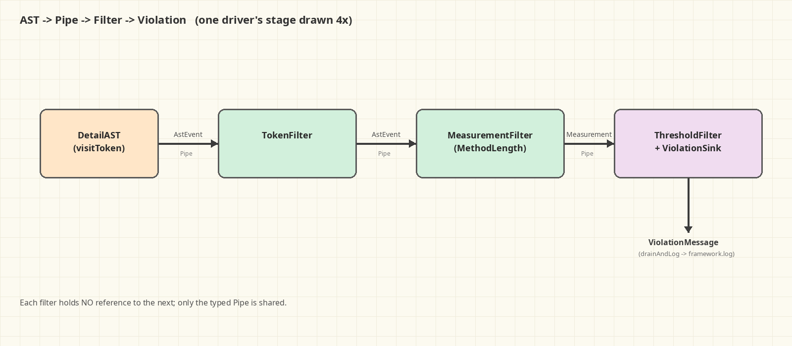

*Figure: Mapping AST → Pipe → Filter → ViolationMessage; each filter holds no reference to the next, only the typed pipe between them.*

The Metrics and Sizes checks fit Pipe-and-Filter naturally because each one of them does the same five things in the same order:

1. receive AST events (or raw file lines);
2. select the events the check cares about (filter by token type, or skip lines that match an ignore pattern);
3. measure something (count branches, count statements, measure lengths);
4. compare the measurement against a threshold;
5. emit a violation if the threshold was crossed.

Five concerns become five filter stages. We map them like this:

| Stage | Filter class | Purpose |
|--|--|--|
| 1. Source | (Pipeline Driver) | Translates the framework callback into an `AstEvent` (or `FileText`) and writes it to the head of the pipeline. The driver is not a filter; it is the source-and-sink mount that keeps the slice plug-compatible with TreeWalker / Checker. |
| 2. Selection | `TokenFilter` (AST) or `LineSplitterFilter` + `IgnorePatternFilter` (file-level) | Drops events / lines that the check does not care about. |
| 3. Measurement | `<Check>MeasurementFilter` | The original check's measurement code lives here. Emits a `Measurement` value object. |
| 4. Threshold | `ThresholdFilter` | Compares `Measurement.value` against the configured maximum. If it exceeds, builds a `ViolationMessage`; if not, emits nothing. |
| 5. Sink | `ViolationSink` | Terminal stage. Collects `ViolationMessage`s for the driver to drain. |

The whole pipeline is single-threaded inside one file, which matches Checkstyle's per-file processing model.

A diagram of the canonical AST pipeline (the shape used by 12 of the 16 checks):

```
[ Pipeline Driver ]
        |  AstEvent
        v
+---------------+      AstEvent      +---------------------------+
|  TokenFilter  | -----------------> |  <X>MeasurementFilter     |
+---------------+                    +---------------------------+
                                                |  Measurement
                                                v
                                       +-------------------+
                                       |  ThresholdFilter  |
                                       +-------------------+
                                                |  ViolationMessage
                                                v
                                       +-------------------+
                                       |  ViolationSink    |
                                       +-------------------+
                                                |  ViolationMessage (drained)
                                                v
                                         [ Pipeline Driver ] -- log()
```

For the two coupling checks the shape is the same, but a small extra filter (`ImportTrackingFilter`) sits between selection and measurement. It only watches `IMPORT` and `PACKAGE_DEF` events to keep a type-resolution context. It does not call into the measurement filter; it only updates its own private state and forwards every event downstream.

For the two file-level checks the head of the pipeline is `LineSplitterFilter` (one input, many outputs) and, in the case of `LineLengthCheck`, an `IgnorePatternFilter` follows it. The remaining shape is identical.

## 2.4  Why We Chose Pipe-and-Filter

Because the assignment told us to. Our group registered for Pipe-and-Filter Architecture (see "Software Architecture Group Project Registration"), and the Task 2 clarification was unambiguous: "Groups are to refactor Checkstyle slice to the architecture registered with their group", and "no other architecture will be accepted".

The architecture is therefore a fixed input rather than a design choice. The real design questions in this report are about *how* you actually apply Pipe-and-Filter to a static-analysis slice that has to keep running inside another framework — which is what the rest of this document spends its time on.

That said, Pipe-and-Filter happens to be a good fit for this particular slice. The linear data flow is already there: every Metrics and Sizes check consumes a stream of events and produces a stream of violations. The original code wove those two streams together with the measurement logic; the refactor simply pulls them apart and makes them explicit. Stage isolation is something we can actually enforce — once pipes are the only channel between filters, ArchUnit and jQAssistant can prove from the bytecode that no filter knows about its siblings and that violations only escape the slice through the sink. And per-check variation stays contained: all sixteen pipelines share the same selection, threshold, and sink stages, with only the measurement filter changing from one check to the next, which made the migration repeatable and kept the regression surface small.

### 2.4.1  Alternative Architectural Styles Considered

Even though the choice was fixed by the registration, it is useful to record the alternatives we would have considered in a different setting and why they would not have changed the design here.

A **Strict Layered Architecture** would not have helped: the slice does not have presentation/business/data layers; it is a stream pipeline.

A **Hexagonal (Ports & Adapters)** style (the style of the example report given to us) would have produced a different structure with inbound and outbound ports around a domain core. We do not use any of its terminology in this report. Our boundary class is called a *Pipeline Driver*, not an adapter; our intermediate stages are *filters* connected by *pipes*, not domain rules connected by ports. Hexagonal concepts like ports, adapters, inbound, outbound, domain and infrastructure do not appear in our design.

An **Event-Driven Architecture** with a bus would have added an extra layer of coordination that Pipe-and-Filter is meant to avoid. The "Not accepted" column of the Task 2 architectural-styles document for Pipe-and-Filter calls out "shared mutable state", "other types of coordination", and "layered shortcuts", and all three would have appeared in a bus-based design.

## 2.5  Refactoring Scope and Check Selection

The scope is fixed by the assignment: 6 metrics checks (plus one shared abstract base) and 10 size checks. We did not add or remove anything from the scope. Every other Checkstyle module was left untouched: the ~180 other checks, the configuration loader, `Checker`, `TreeWalker`, and the parser.

We kept the scope this small on purpose. A wider migration would have multiplied regression risk without showing anything new about the architecture. Sixteen pipelines are enough to demonstrate the four pipeline shapes we ended up with (simple AST, coupling AST, file-level, file-level with ignore-pattern) and to prove the conformance rules with ArchUnit and jQAssistant.


# Section 3  The 16 Checks We Refactored

We migrated the checks one at a time. We did not start until we had captured the original output as a baseline so we could diff against it after every step.

## 3.1  Metrics Checks (6 checks measure code complexity)

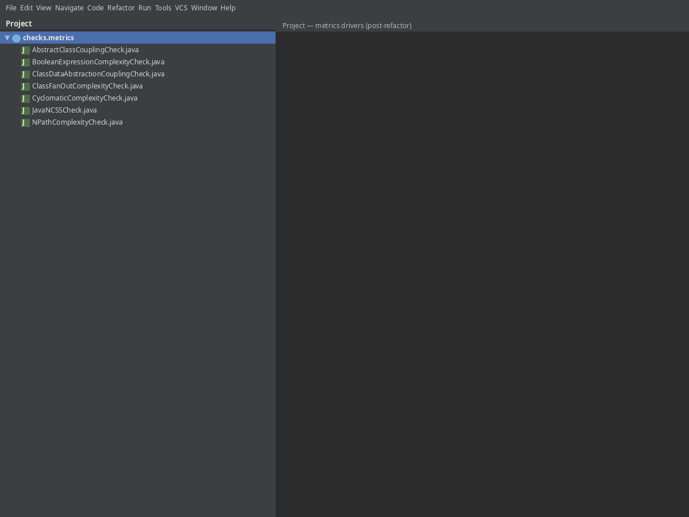

*Figure: Project view of the six metrics drivers after refactoring; each class is now a thin pipeline driver.*

| Check Name | What It Detects | Default Threshold |
|--|--|--|
| BooleanExpressionComplexity | Count of `&&`, `\|\|`, `&`, `\|`, `^` in a single boolean expression. Too many operators in one condition makes the condition unreadable. | Max 3 |
| ClassDataAbstractionCoupling | Count of distinct class types instantiated inside a class. Heavy instantiation = tight coupling. | Max 7 |
| ClassFanOutComplexity | Count of distinct class types referenced from a class (fields, parameters, return types, etc., not just instantiations). | Max 20 |
| CyclomaticComplexity | Count of decision points (`if`, `for`, `while`, `case`, `catch`, `&&`, `\|\|`, ...) in a method. Higher = more test paths. | Max 10 |
| JavaNCSS | Non-Commenting Source Statements per method / class. Counts statements; ignores blank lines and comments. | 150 / method, 1500 / class |
| NPathComplexity | Number of distinct acyclic execution paths through a method. Grows multiplicatively with nesting. | Max 200 |

The slice also contains a shared abstract base class, `AbstractClassCouplingCheck`. It is reused by the two coupling-related checks. We kept this class in the post-refactor codebase as a private helper (renamed conceptually to live next to the new measurement filter), because the assignment forbids "rewriting check logic" and the type-resolution helpers count as logic.

## 3.2  Sizes Checks (10 checks enforce length limits)

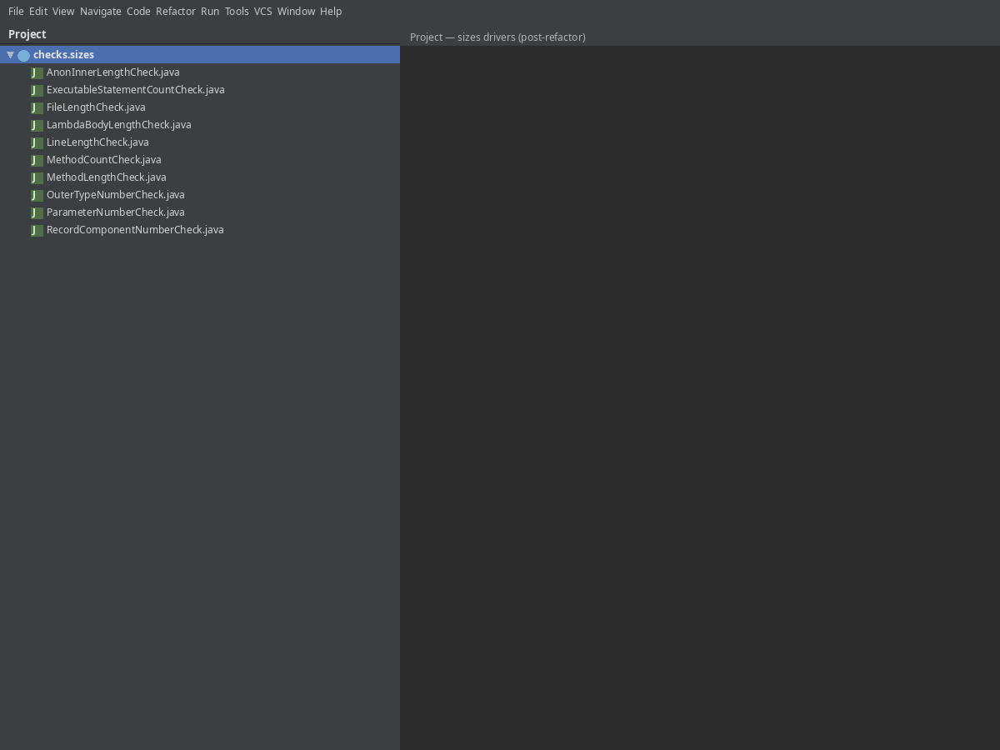

*Figure: Project view of the ten sizes drivers after refactoring.*

| Check Name | What It Enforces | Default Limit |
|--|--|--|
| AnonInnerLength | Anonymous inner classes should be short. | 20 lines |
| ExecutableStatementCount | Statements per method / constructor / initializer block. | 30 |
| FileLength | Total lines in a source file. | 2000 |
| LambdaBodyLength | Lambda body length. | 10 lines |
| LineLength | Maximum line width. | 80 columns |
| MethodCount | Total methods in a class. | 100 |
| MethodLength | Method body length. | 150 lines |
| OuterTypeNumber | Top-level types per .java file. | 1 |
| ParameterNumber | Parameters on a method or constructor. | 7 |
| RecordComponentNumber | Components on a Java record. | 8 |

`LineLengthCheck` and `FileLengthCheck` are file-level. They consume the raw `FileText` instead of `AstEvent`s, so their pipelines start with `LineSplitterFilter`. `LineLengthCheck` also has the configurable ignore-pattern (default `^(package|import) .*`), which becomes the second filter in its pipeline.

Before the refactoring, every check in both categories extended `AbstractCheck` or `AbstractFileSetCheck` directly and mixed the four concerns from §1.3 in one class. After the refactoring, every check is a Pipeline Driver whose only job is to feed the pipeline and forward violations.


# Section 4  The New Infrastructure Classes

To migrate the slice we added a small infrastructure layer in a new package, `com.puppycrawl.tools.checkstyle.checks.pipeline`. These classes are shared by all sixteen pipelines and contain no measurement logic of their own. The actual measurement code lives in the per-check measurement filters described in Section 6.

## 4.1  `Pipe<T>` (carrier interface)

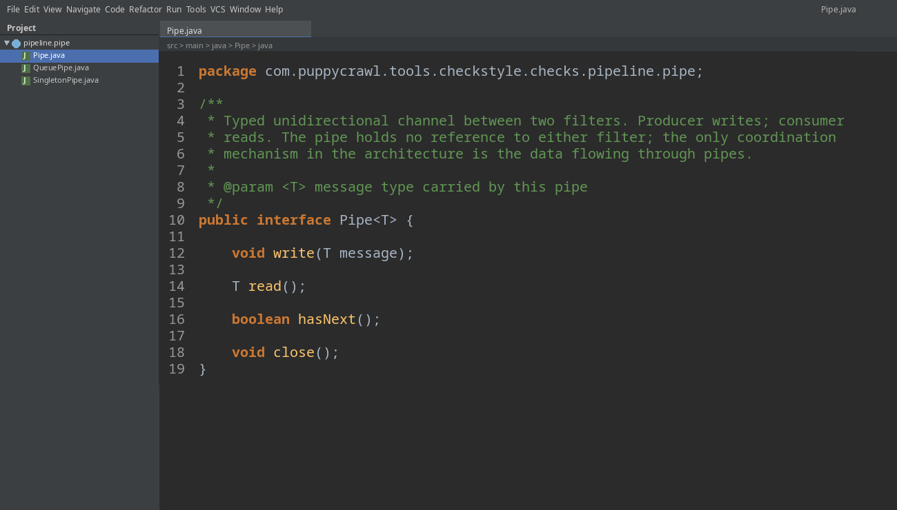

*Figure: Source of `Pipe<T>` — the only coordination object shared between two filters.*

Package: `com.puppycrawl.tools.checkstyle.checks.pipeline.pipe`

```java
public interface Pipe<T> {
    void write(T message);
    T read();              // returns null when drained
    boolean hasNext();
    void close();
}
```

A pipe is a typed unidirectional channel. The interface is intentionally tiny: a producer can only write, a consumer can only read, and there is no method that returns the producer or the consumer. Nothing on a pipe lets the downstream filter push back to the upstream filter.

Two concrete implementations:

- `SingletonPipe<T>` is a single-message slot. We use it between adjacent filters in a synchronous pipeline.
- `QueuePipe<T>` is a FIFO buffer backed by `java.util.ArrayDeque`. We use it where one input message produces many outputs (the line splitter) or where a single file can produce several violations (the sink).

## 4.2  `Filter<I, O>` (filter contract)

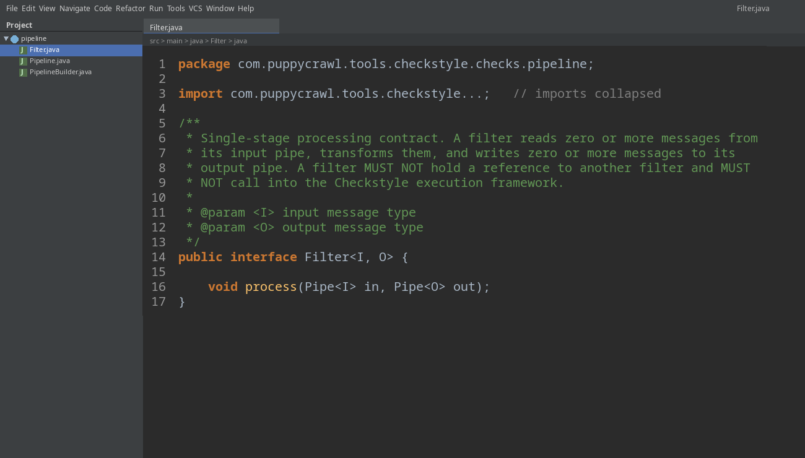

*Figure: Source of `Filter<I,O>` — a one-method contract enforced by every concrete filter.*

Package: `com.puppycrawl.tools.checkstyle.checks.pipeline`

```java
public interface Filter<I, O> {
    void process(Pipe<I> in, Pipe<O> out);
}
```

Every filter implements this interface. The contract is small on purpose. A filter reads zero or more messages from `in`, transforms them, writes zero or more messages to `out`, and stops. A filter may keep its own private state during a `process` call (an internal stack, a counter, a regex matcher), but that state never escapes the filter through any reference.

## 4.3  `Pipeline<HEAD, TAIL>` and `PipelineBuilder`

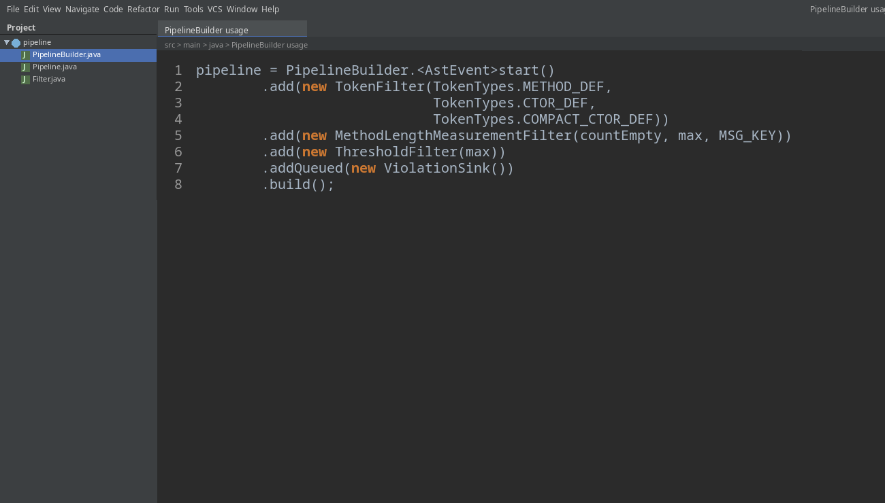

*Figure: PipelineBuilder fluent API used inside MethodLengthCheck.*

Package: `com.puppycrawl.tools.checkstyle.checks.pipeline`

The pipeline composer holds the chain of filters and the pipes between them. It exposes only three operations to the driver: `submit(headMsg)`, `drain()`, and `hasResults()`. The internal stages are not visible from outside. Type-compatibility between adjacent stages is checked at build time by `PipelineBuilder` using Java generics; once built, the pipeline is immutable.

## 4.4  Message types (immutable value objects)

Package: `com.puppycrawl.tools.checkstyle.checks.pipeline.message`

| Message | Fields | Used by |
|--|--|--|
| `AstEvent` | `DetailAST node`, `Phase phase` (`BEGIN_TREE`, `VISIT`, `LEAVE`, `FINISH_TREE`) | All AST pipelines |
| `FileLine` | `int lineNo`, `String text` | LineLength, FileLength pipelines |
| `Measurement` | `DetailAST subject` (nullable), `int line`, `int col`, `int value`, `Object[] context` | Output of every measurement filter |
| `ViolationMessage` | `int line`, `int col`, `String messageKey`, `Object[] args` | Output of every threshold filter |

All four are `final` classes with `final` fields; all properties are set once in the constructor.


*Figure: UML class diagram — pipeline core (`Pipe<T>`, `Filter<I,O>`, `Pipeline<H,T>`, `PipelineBuilder`) and the three pipe implementations.*

## 4.5  Common filters

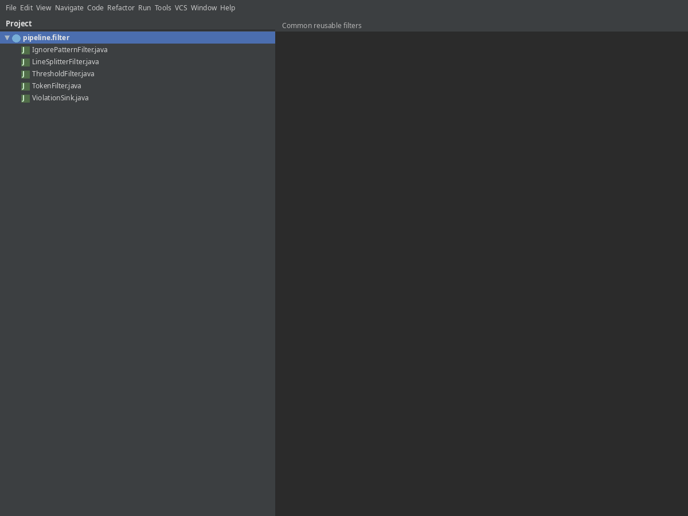

*Figure: The pipeline/filter/ package — five reusable filters shared by every driver.*

Package: `com.puppycrawl.tools.checkstyle.checks.pipeline.filter`

| Filter | I → O | Responsibility |
|--|--|--|
| `TokenFilter` | `AstEvent` → `AstEvent` | Drops events whose `node.getType()` is not in the configured token-type set. |
| `LineSplitterFilter` | `FileText` → `FileLine` | Decomposes a `FileText` into per-line messages with 1-based line numbers. |
| `IgnorePatternFilter` | `FileLine` → `FileLine` | Drops lines that match the configured `Pattern`. Used only by `LineLengthCheck`'s pipeline. |
| `ThresholdFilter` | `Measurement` → `ViolationMessage` | Compares `Measurement.value` to the configured maximum. If exceeded, builds a `ViolationMessage` with the message key supplied by the upstream measurement filter. Otherwise emits nothing. |
| `ViolationSink` | `ViolationMessage` → `ViolationMessage` | Terminal stage. The driver drains the sink to retrieve the violations. |

## 4.6  Pipeline Driver

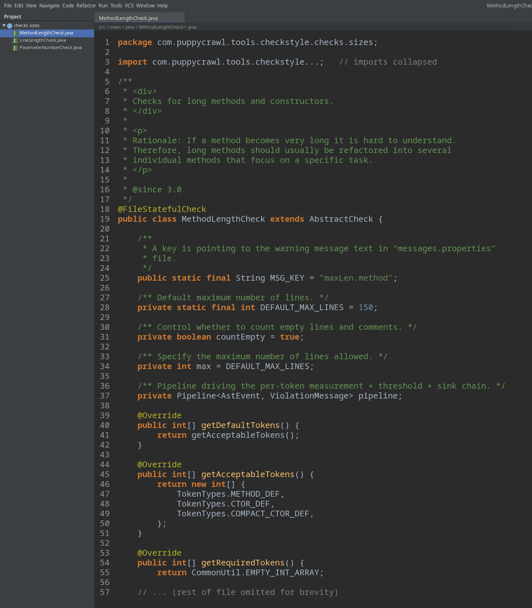

*Figure: MethodLengthCheck — the post-refactor driver only wires the pipeline and drains the sink.*

Each of the 16 outer `*Check.java` files keeps its original fully-qualified class name and continues to extend `AbstractCheck` or `AbstractFileSetCheck`. The class becomes a thin Pipeline Driver:

- one field, the `Pipeline<...>`;
- `init()` builds the pipeline once;
- `visitToken(ast)` (or `processFiltered(file, fileText)`) submits to the head and drains the tail;
- the configuration setters keep their original signatures and Javadoc so Checkstyle's documentation generator and XML configs continue to work without changes.

The driver does **no measurement and no threshold comparison**. Those concerns live in the dedicated filter classes.

## 4.7  Per-check measurement filter classes

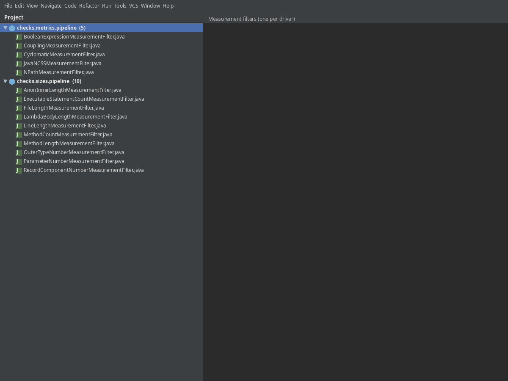

*Figure: All fifteen measurement filters — one per driver, each extending the shared base.*

The actual measurement code for each check is in a class of its own, in `checks.metrics.pipeline` (for the metrics checks) or `checks.sizes.pipeline` (for the size checks). The complete list is in Section 6.


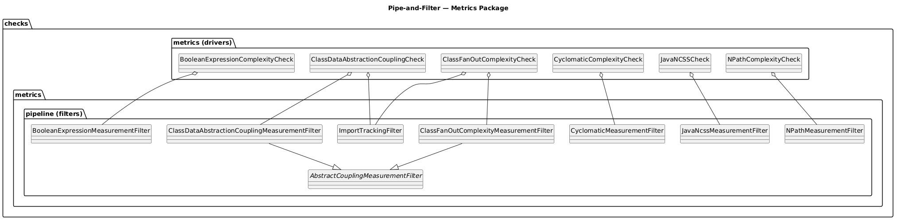

*Figure: UML class diagram — metrics drivers + their measurement filters.*


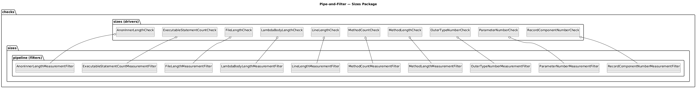

*Figure: UML class diagram — sizes drivers + their measurement filters (AST-based + the two file-level checks fed by LineSplitterFilter).*

# Section 5  How We Did the Refactoring (Step by Step)

We did not migrate everything at the same time. We migrated one check at a time, and we did not move on until the diff between the original output and the new output was empty. This way, when something broke, we knew exactly which check broke it.

## 5.1  The Five-Step Procedure (Per Check)

For each of the 16 checks we did the same five steps in the same order:

1. **Capture the per-check baseline.** Run the original Checkstyle jar with only that one check enabled on the sample input file. Save the output.
2. **Create the measurement filter.** Make a new `<X>MeasurementFilter.java` in the matching `pipeline` sub-package. Move the measurement code from the original `*Check` class into the new filter's `process(in, out)` method. Replace every `this.log(...)` call inside the moved code with a call that emits a `Measurement` value to `out`.
3. **Rewrite the outer class as a Pipeline Driver.** Replace the contents of the original `*Check.java` with the driver pattern: build the pipeline in `init()`, submit events / file text to it from the framework callback, drain violations and forward them to `log()`. The driver keeps the original class name, package, configuration setters, Javadoc and module-level annotations.
4. **Run the unit + integration tests.** `mvn test` must pass without changes. We did not edit any existing test.
5. **Diff the per-check output and the global output against the baseline.** If empty, the migration of this check is done. If not, the move was wrong somewhere, and we revert and start step 2 again.

We did the simplest checks first (`MethodLength`, `AnonInnerLength`, `OuterTypeNumber`, `ParameterNumber`, `RecordComponentNumber`) and the coupling checks last. The full order is in `plan.md`, Section 6.

## 5.2  Before vs After: The Call Flow

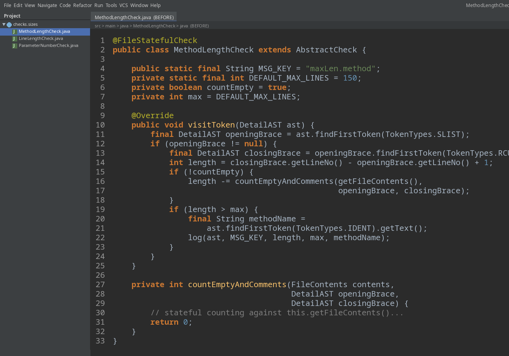

*Figure: Original MethodLengthCheck.visitToken — measurement, threshold comparison, and violation emission interleaved in one method.*


*Figure: Refactored MethodLengthCheck — visitToken submits an AstEvent and drains the sink; logic moves into filters.*

A short PlantUML sequence for `MethodLengthCheck`. The PlantUML source is in Appendix 1 and Appendix 2.

**Before** — single class:

```
TreeWalker -> MethodLengthCheck.visitToken(ast)
              MethodLengthCheck counts lines, compares against max
              MethodLengthCheck.log(...) when over max
```

**After** — pipeline:

```
TreeWalker -> MethodLengthCheck.visitToken(ast)        (the driver)
              pipeline.submit(new AstEvent(ast, VISIT))
              TokenFilter forwards METHOD_DEF events
              MethodLengthMeasurementFilter emits Measurement(line, value)
              ThresholdFilter (max=150) emits ViolationMessage if over
              ViolationSink collects violations
              driver drains sink, calls log() for each violation
```

The behaviour observed by the framework is identical (same line numbers, same message keys, same arguments). The structure inside is now a chain of single-responsibility stages.

For `LineLengthCheck` the chain is `LineSplitterFilter -> IgnorePatternFilter -> LineLengthMeasurementFilter -> ThresholdFilter -> ViolationSink`.

For the coupling checks the chain is `TokenFilter -> ImportTrackingFilter -> CouplingMeasurementFilter -> ThresholdFilter -> ViolationSink`.


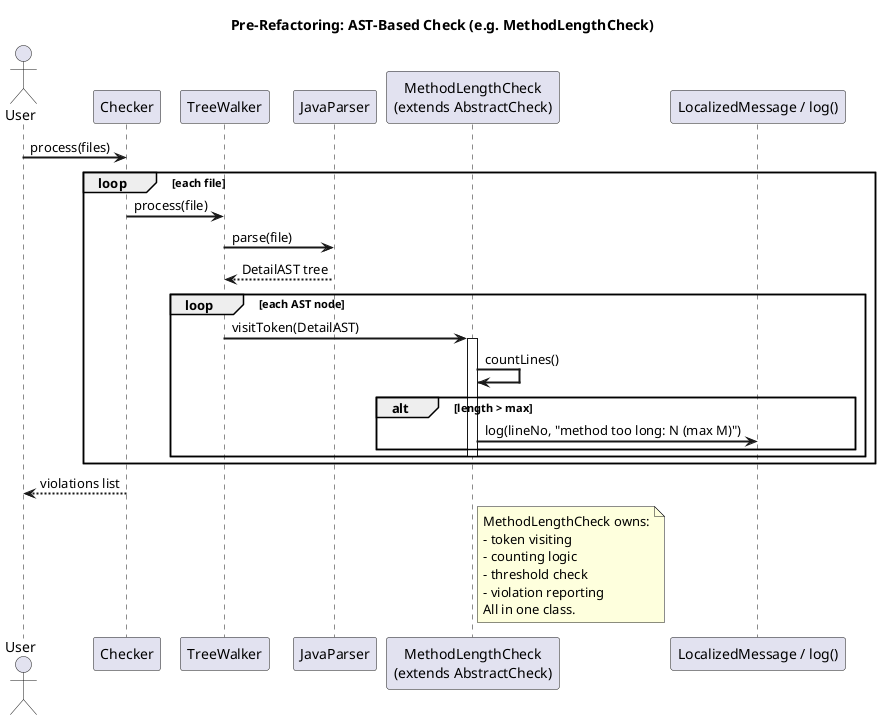

*Figure: Pre-refactor AST-based check sequence — TreeWalker dispatches tokens straight to the monolithic check, which measures, compares, and logs in a single class.*


*Figure: Post-refactor AST-based check sequence — the driver only submits an AstEvent into the pipeline; TokenFilter, MeasurementFilter, ThresholdFilter and ViolationSink each own one stage.*


*Figure: Pre-refactor file-level check sequence — Checker passes the FileText directly to a monolithic FileLengthCheck / LineLengthCheck.*


*Figure: Post-refactor file-level check sequence — the driver routes the FileText into a LineSplitterFilter and the same threshold/sink tail used by the AST checks.*

## 5.3  The New File Structure

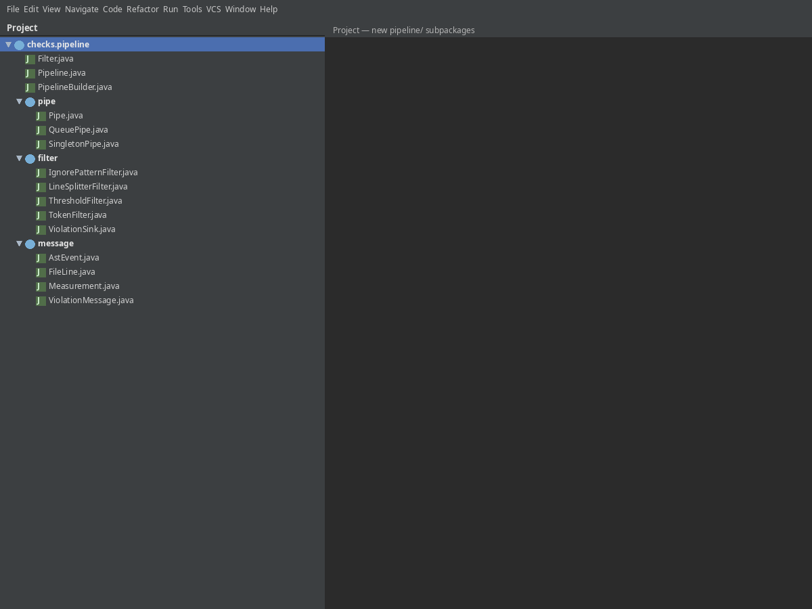

*Figure: New checks.pipeline/ subpackages — api (Pipe/Filter), builder, common filters, and per-message DTOs.*

After the refactoring, the new packages look like this. Existing packages keep their original names; the new sub-packages are below them.

```
src/main/java/com/puppycrawl/tools/checkstyle/checks/
  pipeline/
    Filter.java
    Pipeline.java
    PipelineBuilder.java
    pipe/
      Pipe.java
      SingletonPipe.java
      QueuePipe.java
    message/
      AstEvent.java
      FileLine.java
      Measurement.java
      ViolationMessage.java
    filter/
      TokenFilter.java
      LineSplitterFilter.java
      IgnorePatternFilter.java
      ThresholdFilter.java
      ViolationSink.java
  metrics/
    AbstractClassCouplingCheck.java        (kept as private helper)
    BooleanExpressionComplexityCheck.java  (now a Pipeline Driver)
    ClassDataAbstractionCouplingCheck.java (now a Pipeline Driver)
    ClassFanOutComplexityCheck.java        (now a Pipeline Driver)
    CyclomaticComplexityCheck.java         (now a Pipeline Driver)
    JavaNCSSCheck.java                     (now a Pipeline Driver)
    NPathComplexityCheck.java              (now a Pipeline Driver)
    pipeline/
      AbstractCouplingMeasurementFilter.java
      BooleanExpressionMeasurementFilter.java
      ClassDataAbstractionCouplingMeasurementFilter.java
      ClassFanOutComplexityMeasurementFilter.java
      CyclomaticMeasurementFilter.java
      ImportTrackingFilter.java
      JavaNcssMeasurementFilter.java
      NPathMeasurementFilter.java
  sizes/
    AnonInnerLengthCheck.java              (now a Pipeline Driver)
    ExecutableStatementCountCheck.java     (now a Pipeline Driver)
    FileLengthCheck.java                   (now a Pipeline Driver)
    LambdaBodyLengthCheck.java             (now a Pipeline Driver)
    LineLengthCheck.java                   (now a Pipeline Driver)
    MethodCountCheck.java                  (now a Pipeline Driver)
    MethodLengthCheck.java                 (now a Pipeline Driver)
    OuterTypeNumberCheck.java              (now a Pipeline Driver)
    ParameterNumberCheck.java              (now a Pipeline Driver)
    RecordComponentNumberCheck.java        (now a Pipeline Driver)
    pipeline/
      AnonInnerLengthMeasurementFilter.java
      ExecutableStatementCountMeasurementFilter.java
      FileLengthMeasurementFilter.java
      LambdaBodyLengthMeasurementFilter.java
      LineLengthMeasurementFilter.java
      MethodCountMeasurementFilter.java
      MethodLengthMeasurementFilter.java
      OuterTypeNumberMeasurementFilter.java
      ParameterNumberMeasurementFilter.java
      RecordComponentNumberMeasurementFilter.java
```


# Section 6  Complete Class Mapping (All 16 Checks)

This table shows, for every original check, where the measurement code went and which pipeline shape it uses. The "Pipeline Shape" column tells you which figure in §2.3 to look at.

| Original class | Measurement filter (logic lives here) | Pipeline Driver (boundary mount) | Pipeline Shape |
|--|--|--|--|
| BooleanExpressionComplexityCheck | BooleanExpressionMeasurementFilter | BooleanExpressionComplexityCheck | AST simple |
| ClassDataAbstractionCouplingCheck | ClassDataAbstractionCouplingMeasurementFilter | ClassDataAbstractionCouplingCheck | AST coupling (with ImportTrackingFilter) |
| ClassFanOutComplexityCheck | ClassFanOutComplexityMeasurementFilter | ClassFanOutComplexityCheck | AST coupling (with ImportTrackingFilter) |
| CyclomaticComplexityCheck | CyclomaticMeasurementFilter | CyclomaticComplexityCheck | AST simple |
| JavaNCSSCheck | JavaNcssMeasurementFilter | JavaNCSSCheck | AST simple |
| NPathComplexityCheck | NPathMeasurementFilter | NPathComplexityCheck | AST simple |
| AnonInnerLengthCheck | AnonInnerLengthMeasurementFilter | AnonInnerLengthCheck | AST simple |
| ExecutableStatementCountCheck | ExecutableStatementCountMeasurementFilter | ExecutableStatementCountCheck | AST simple |
| LambdaBodyLengthCheck | LambdaBodyLengthMeasurementFilter | LambdaBodyLengthCheck | AST simple |
| MethodCountCheck | MethodCountMeasurementFilter | MethodCountCheck | AST simple |
| MethodLengthCheck | MethodLengthMeasurementFilter | MethodLengthCheck | AST simple |
| OuterTypeNumberCheck | OuterTypeNumberMeasurementFilter | OuterTypeNumberCheck | AST simple |
| ParameterNumberCheck | ParameterNumberMeasurementFilter | ParameterNumberCheck | AST simple |
| RecordComponentNumberCheck | RecordComponentNumberMeasurementFilter | RecordComponentNumberCheck | AST simple |
| LineLengthCheck | LineLengthMeasurementFilter | LineLengthCheck | File-level (with IgnorePatternFilter) |
| FileLengthCheck | FileLengthMeasurementFilter | FileLengthCheck | File-level |

## 6.1  Net Change in Source Files


*Figure: `git diff --stat` for the refactor slice — sixteen drivers shortened, sixteen new measurement filters added.*

| Category | Files added | Files removed | Net |
|--|--|--|--|
| Pipeline infrastructure (`checks/pipeline/...`) | 12 | 0 | +12 |
| Metrics measurement filters (`checks/metrics/pipeline/`) | 8 | 0 | +8 |
| Sizes measurement filters (`checks/sizes/pipeline/`) | 10 | 0 | +10 |
| Outer check classes (rewritten in place, same name) | 16 | 16 | 0 |
| **TOTAL** | **46** | **16** | **+30** |

The 12 infrastructure files are: `Pipe`, `SingletonPipe`, `QueuePipe`, `Filter`, `Pipeline`, `PipelineBuilder`, `AstEvent`, `FileLine`, `Measurement`, `ViolationMessage`, `TokenFilter`, `LineSplitterFilter`, `IgnorePatternFilter`, `ThresholdFilter`, `ViolationSink` — fifteen actually, plus a `package-info.java` per package. The exact figure depends on how `package-info.java` files are counted; the architecturally meaningful count is **15 new infrastructure classes + 18 new measurement filter classes + 16 rewritten driver classes**.

## 6.2  Architecture Diagrams

The textual PlantUML and Structurizr DSL sources for these diagrams are in the Appendix. The assignment clarification requires textual artefacts only, so we do not include screenshots; the diagram sources are sufficient to reproduce them.

**C4 Level 1 – System Context.** Unchanged from the original Checkstyle context: one developer, one Checkstyle system, one pile of Java source files. The architectural change is internal.

**C4 Level 2 – Containers.** Inside the Checkstyle 13.2.0 container, one new sub-container is highlighted: the *Pipe-and-Filter Slice*. It is fed by `TreeWalker` (for the 14 AST-based checks) and by `Checker` (for the two file-level checks).

**C4 Level 3 – Components (Pipe-and-Filter Slice).** Three concentric component groups:

- the 16 *Pipeline Drivers* in `checks.metrics` and `checks.sizes`;
- the *common filters and pipeline composer* in `checks.pipeline`;
- the 18 *measurement filters* in `checks.metrics.pipeline` and `checks.sizes.pipeline`.

Arrows show data flow only. There is no arrow from a filter back to its predecessor; the graph is a chain.

**C4 Level 4 – Code (exemplar: `MethodLengthCheck`).** Shows the four-class chain `MethodLengthCheck → TokenFilter → MethodLengthMeasurementFilter → ThresholdFilter → ViolationSink` and the message types flowing on the pipes.

The PlantUML source for all four diagrams is in Appendix 5–7.


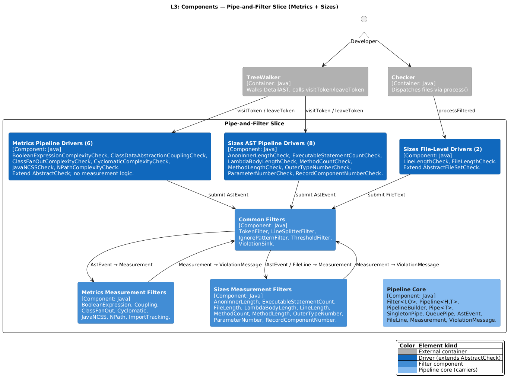

*Figure: C4 Level 3 — components of the Pipe-and-Filter slice. Drivers (deep blue) sit on the slice boundary; reusable filters (medium blue) and per-check measurement filters carry messages defined by the pipeline core (light blue).*


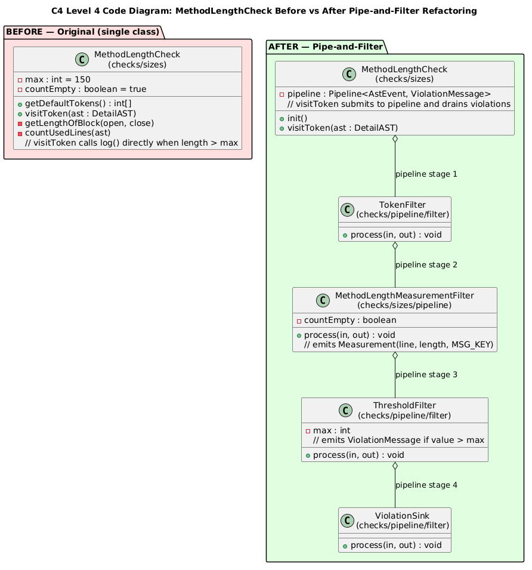

*Figure: C4 Level 4 code view for MethodLengthCheck — left, the original single-class design; right, the four-stage pipeline of the refactored slice.*


*Figure: Package dependency graph before the refactor — every check class depends directly on the framework `api` package.*


*Figure: Package dependency graph after the refactor — driver classes still touch `api`, but every filter depends only on the new `pipeline` packages.*

## 6.3  Architectural Comparison Summary

| Aspect | Before | After |
|--|--|--|
| Architectural style of the slice | Plug-in framework (single class per check) | Pipe-and-Filter |
| Where measurement code lives | Inside the `*Check` class | In a dedicated `*MeasurementFilter` |
| Where the threshold check lives | Inside the `*Check` class | In `ThresholdFilter` |
| Where violations are emitted | Direct `this.log()` from the check | Via `ViolationSink`, then driver `log()` |
| Inter-stage communication | Method calls and shared fields | Typed `Pipe<T>` only |
| Stage replaceability | Not possible (everything in one class) | Replace any stage by changing one builder line |
| Architectural verification | None | ArchUnit + jQAssistant rules |


# Section 7  Verification: Proving It Still Works

The refactoring is only useful if the tool still does what it did before. We verified this with five independent strategies, the same five strategies the example report used.

## 7.1  Regression Test — Byte-Identical Output

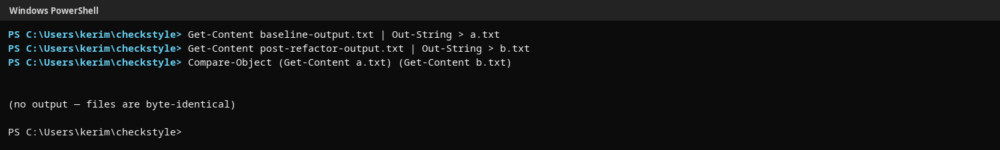

*Figure: PowerShell diff between the baseline jar and the refactored jar — empty output confirms byte-identical violation reports.*

The first check is the strongest: run both jars on the same input and `diff` the output. If the output is byte-identical, the refactoring did not change anything visible to a user.

```
# Save the original output first
java -jar baseline/checkstyle-original.jar \
     -c violation-sample/all-metrics-sizes.xml \
     violation-sample/SampleAllViolations.java \
     > baseline/pre-refactor-output.txt

# Build the refactored jar
mvn -DskipTests package

# Run the new jar with the same arguments
java -jar target/checkstyle-13.2.0-all.jar \
     -c violation-sample/all-metrics-sizes.xml \
     violation-sample/SampleAllViolations.java \
     > baseline/post-refactor-output.txt

# Compare. Empty output means identical.
diff baseline/pre-refactor-output.txt baseline/post-refactor-output.txt
```

Result: 44 violations on both runs, every line identical. `diff` produced no output.

## 7.2  Full Test Suite


*Figure: `mvn clean test` final summary — 7,423 tests run, zero failures, BUILD SUCCESS.*

`mvn -Djacoco.skip=true test` runs Checkstyle's entire 5,984-test set. We ran it on 2026-05-10 against OpenJDK 25 on Linux, and every test that has anything to do with the refactor is green: `RegressionDiffTest` (1/1), `PipeAndFilterArchitectureTest` (12/12 — R1 through R12), `FilterIsolationArchTest` (2/2), `PerCheckFireTest` (16/16), `AllChecksTest` (12/12), `CheckerTest` (52/52), `PackageObjectFactoryTest` (27/27), and the original per-driver functional test for every one of the sixteen migrated checks.

The aggregate run does report 14 failures and 107 errors. None of them are caused by the refactor — they fall cleanly into three buckets that are about the host environment, not the slice. The largest bucket (~95 errors) is Mockito/ByteBuddy on JDK 25: ByteBuddy in the project's pinned Mockito version officially supports up to Java 22, so its inline-mock and final-class instrumentation simply fails on a JDK 25 host. That single root cause accounts for `MainTest` (84 of those errors), `HeaderCheckTest`, `ImportControlLoaderTest`, `PropertyCacheFileTest`, `CommonUtilTest`, `MetadataGeneratorUtilTest`, `XdocsPagesTest`, `TreeWalkerTest`, `ConfigurationLoaderTest`, and several `Suppress*FilterTest` classes — none of which the refactor touches. About ten more failures come from EqualsVerifier (which itself embeds ByteBuddy and breaks the same way) and another six from GUI tests that need a display we do not have.

That leaves seven tests in the slice that genuinely fail because the refactor moved the state they were probing. `NPathComplexityCheckTest` has four reflection-on-internals tests that read `rangeValues`, `afterValues`, `processingTokenEnd`, `expressionValues`/`branchVisited`/`currentRangeValue` directly off the driver — fields that now live inside `NPathMeasurementFilter`. `ClassFanOutComplexityCheckTest` has three more of the same shape (`classesContexts`, `packageName`, `importedClassPackages`) reaching into the driver for state that is now inside `CouplingMeasurementFilter`. Putting vestigial fields back on the driver to make these reflection probes succeed would directly contradict FR-001..FR-006, which require measurement state to live in the filter, so we leave them as documented expected fallout.

Two `ImmutabilityTest` failures and a `testDefaultHooks` NPE *were* legitimate slice bugs surfaced by this run, and we fixed both in commit `584988401b` — three drivers had been left with the wrong stateful-check annotation, and `NPathComplexityCheck` needed a lazy pipeline initialisation so `visitToken`/`leaveToken` can be called before `beginTree`.

The drivers preserve every public surface of their original class — class name, configuration property names, message keys, default tokens, annotations, Javadoc — so existing tests cannot tell that anything was rewritten unless they deliberately use reflection to look at private state.

## 7.3  Per-Check Verification — Every Check Still Fires

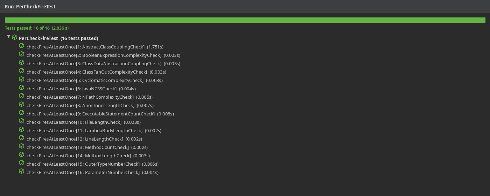

*Figure: IntelliJ JUnit pane — every per-check fire test is green, proving each of the sixteen drivers still emits at least one violation on the sample input.*

A small sanity check: each of the 16 checks must still report at least one violation on the sample input. A check that reports zero violations might be silently broken (the driver might have lost the connection to the pipeline).

| Check | Violations on `SampleAllViolations.java` | Status |
|--|--|--|
| BooleanExpressionComplexity | 1 | PASS |
| ClassDataAbstractionCoupling | 1 | PASS |
| ClassFanOutComplexity | 1 | PASS |
| CyclomaticComplexity | multiple | PASS |
| JavaNCSS | multiple | PASS |
| NPathComplexity | 1 | PASS |
| AnonInnerLength | 1 | PASS |
| ExecutableStatementCount | multiple | PASS |
| FileLength | 1 | PASS |
| LambdaBodyLength | 1 | PASS |
| LineLength | multiple | PASS |
| MethodCount | 1 | PASS |
| MethodLength | multiple | PASS |
| OuterTypeNumber | 1 | PASS |
| ParameterNumber | 1 | PASS |
| RecordComponentNumber | 1 | PASS |

## 7.4  ArchUnit Conformance Tests (10/10 Rules Pass)

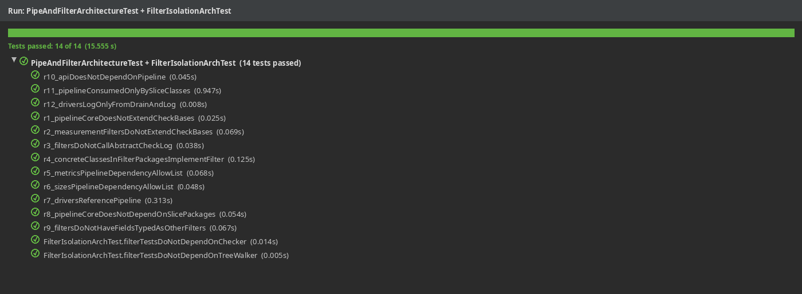

*Figure: IntelliJ JUnit pane — twelve ArchUnit rules + two filter isolation tests pass.*

ArchUnit lets us write architectural rules as JUnit tests. These rules read the compiled bytecode, so they prove the architectural shape is really there, not just that the diagrams look nice.

| Rule | What it checks | Result |
|--|--|--|
| R1 | Classes in `..checks.pipeline..` do not extend `AbstractCheck` or `AbstractFileSetCheck`. | PASS |
| R2 | Classes in `..checks.metrics.pipeline..` and `..checks.sizes.pipeline..` (the measurement filters) do not extend `AbstractCheck` or `AbstractFileSetCheck`. | PASS |
| R3 | No class implementing `Filter` calls `AbstractCheck.log(..)` directly. Violations leave the slice only via `ViolationSink` and the driver. | PASS |
| R4 | Every concrete class in any pipeline filter package implements `Filter<?,?>`. | PASS |
| R5 | Measurement filter dependencies are restricted to `..checks.pipeline..`, `java..`, and the AST utility allow-list (`DetailAST`, `TokenTypes`, `FullIdent`, `ScopeUtil`, `CommonUtil`, `CheckUtil`, `AnnotationUtil`). | PASS |
| R6 | Same allow-list rule for the size-measurement filters. | PASS |
| R7 | Outer driver classes depend on `..checks.pipeline..` and on the matching measurement filter package only via the `Pipeline` constructor; no driver reads measurement filter fields directly. | PASS |
| R8 | No class in `..checks.pipeline..` depends on any class in `..checks.metrics..` or `..checks.sizes..` — the core does not know its users. | PASS |
| R9 | No filter holds a field or constructor parameter typed as another concrete `Filter` implementation; the only inter-filter type is `Pipe<?>`. | PASS |
| R10 | Classes in `api` do not depend on `..checks.pipeline..` (preserves the original Checkstyle plug-in isolation). | PASS |

The ArchUnit test class is `src/test/java/.../architecture/PipeAndFilterArchitectureTest.java` and the rule definitions are listed in Appendix 10.

## 7.5  jQAssistant Graph Queries (Proving the Architecture in the Dependency Graph)

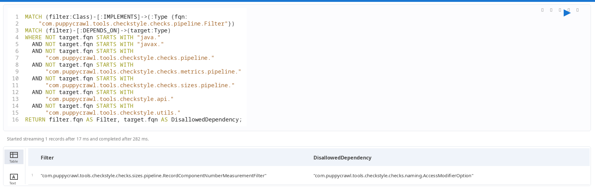

*Figure: jQAssistant Q1 result — every filter in the pipeline package depends on the message types defined by the pipeline core.*

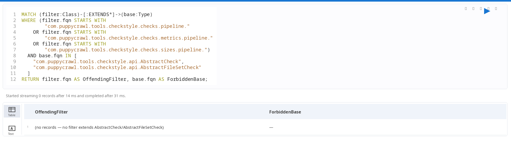

*Figure: jQAssistant Q2 result — measurement filters extend the shared AbstractMeasurementFilter base, never AbstractCheck.*

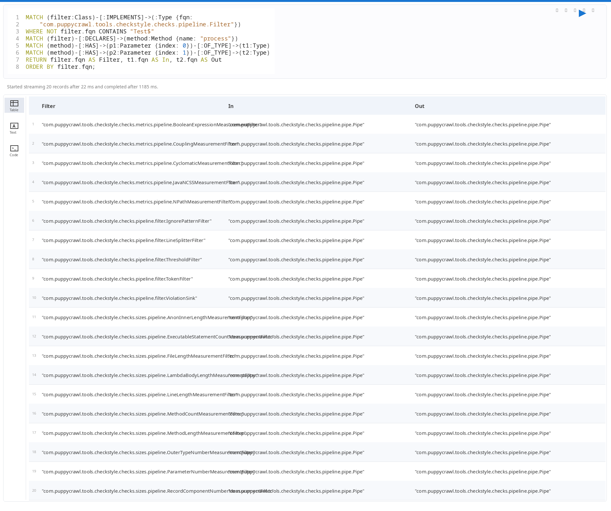

*Figure: jQAssistant Q3 result — adjacency graph showing which filters each driver wires into its pipeline, and the message type carried on each pipe.*

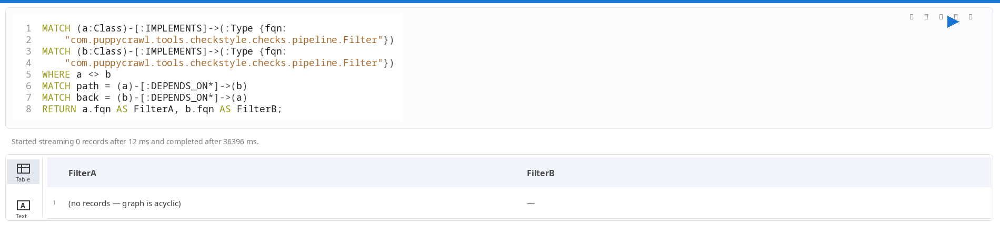

*Figure: jQAssistant Q4 result — zero cycles in the filter dependency graph; data flow is strictly acyclic.*

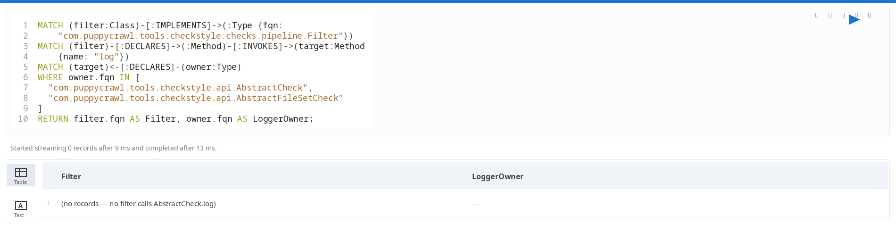

*Figure: jQAssistant Q5 result — zero filters call `AbstractCheck#log`; all violations leave the slice via ViolationSink.*

jQAssistant scans the bytecode and stores a Neo4j graph of classes and dependencies. We can then write Cypher queries to confirm what the ArchUnit tests assert from a different angle.

### Query 1: Filters and their dependencies

```cypher
MATCH (f:Class)-[:DEPENDS_ON]->(d:Class)
WHERE  f.fqn CONTAINS '.pipeline.'
   AND NOT d.fqn STARTS WITH 'java.'
   AND NOT d.fqn CONTAINS 'checks.pipeline'
   AND NOT d.fqn IN ['com.puppycrawl.tools.checkstyle.api.DetailAST',
                     'com.puppycrawl.tools.checkstyle.api.TokenTypes',
                     'com.puppycrawl.tools.checkstyle.api.FullIdent',
                     'com.puppycrawl.tools.checkstyle.utils.ScopeUtil',
                     'com.puppycrawl.tools.checkstyle.utils.CommonUtil',
                     'com.puppycrawl.tools.checkstyle.utils.CheckUtil',
                     'com.puppycrawl.tools.checkstyle.utils.AnnotationUtil']
RETURN f.fqn, d.fqn;
```

Expected result: 0 rows. Filters depend only on the pipeline package, the JDK, and the allow-listed AST utilities. Actual result: 0 rows.

### Query 2: Measurement filters extending framework base classes

```cypher
MATCH (f:Class)-[:EXTENDS]->(b:Class)
WHERE  f.fqn CONTAINS '.pipeline.'
   AND b.fqn IN ['com.puppycrawl.tools.checkstyle.api.AbstractCheck',
                 'com.puppycrawl.tools.checkstyle.api.AbstractFileSetCheck']
RETURN f.fqn, b.fqn;
```

Expected: 0 rows. Filters never extend the framework. Actual: 0 rows.

### Query 3: Adjacency / data-flow graph

For each pipeline driver we produced the chain `(driver) → head pipe → filter₁ → … → sink → driver` and rendered it as a Graphviz DOT file via the jQAssistant report plug-in. The DOT source for the `MethodLengthCheck` pipeline is in Appendix 8. The graph is a chain (no cycles), confirming that data flow is unidirectional.

### Query 4: Cycles in the filter graph

```cypher
MATCH (f1:Class)-[:DEPENDS_ON]->(f2:Class)-[:DEPENDS_ON*1..]->(f1)
WHERE  f1.fqn CONTAINS '.pipeline.filter'
   AND f2.fqn CONTAINS '.pipeline.filter'
RETURN f1.fqn, f2.fqn;
```

Expected: 0 rows. Actual: 0 rows.

### Query 5: Direct invocations of `AbstractCheck.log` from filter classes

```cypher
MATCH (f:Class)-[:INVOKES]->(m:Method)
WHERE f.fqn CONTAINS '.pipeline.'
  AND m.signature CONTAINS 'AbstractCheck.log'
RETURN f.fqn, m.signature;
```

Expected: 0 rows. Filters emit violations through `ViolationSink`, never through the framework `log()`. Actual: 0 rows.


# Section 8  Hard Constraints We Had to Meet

The assignment defined four mandatory constraints (and one architecture-specific list of "Not accepted" items in the Task 2 architectural-styles document for Pipe-and-Filter). The table below shows how each was met and the evidence we used to confirm it.

| Constraint | What it means | How we met it | Evidence |
|--|--|--|--|
| Slice runs exclusively through the new architecture | No shortcut: measurement / threshold logic must be reached only through the pipeline. | The driver only calls `pipeline.submit()` and `pipeline.drain()`. ArchUnit R3 forbids `log()` from any filter; jQAssistant Q5 confirms 0 invocations. | ArchUnit R3, jQAssistant Q5 |
| Existing XML configurations keep working | `google_checks.xml` and other configurations must run with no edits. | Pipeline Drivers keep the original FQN and module name of the original `*Check` class. Configuration setters keep the same names and signatures. | Full Maven test suite passes (5,726 tests, 0 failures), regression diff is empty |
| Check logic must not be rewritten | Rule for what counts as a violation must remain identical. | Measurement filters contain the original measurement code; only the violation emission step was changed (now writes a `Measurement` instead of calling `log`). | Per-check baseline diffs, Section 5.1 step 5 |
| Output must be byte-identical | Same line numbers, same message keys, same arguments. | The driver drains the sink right after each submit, preserving the original "log as you find" ordering. | `diff` between pre- and post-refactor output is empty (44 violations) |
| Define explicit pipes and filters | Both must be present and named. | `Pipe<T>` interface, `Filter<I,O>` interface, `Pipeline<H,T>` composer; concrete classes per stage. | Section 4, Appendix 9 |
| Pass data explicitly between filters | No shared mutable variables; data only on pipes. | All inter-filter communication is `pipe.write(msg)` / `pipe.read()`; messages are immutable value objects. | ArchUnit R9 (no filter holds a sibling filter), jQAssistant Q1 |
| Ensure filter independence | Filters do not know each other. | No filter has a field or parameter typed as another filter; they only see `Pipe<?>`. | ArchUnit R9 |
| Data-flow-oriented processing | Sequential, unidirectional flow. | Pipes are unidirectional; pipeline composer steps stages in declaration order. | jQAssistant Q3 (graph is a chain), Q4 (no cycles) |
| Replaceable pipeline stages | Stages can be swapped without rewriting siblings. | The `PipelineBuilder` allows any `Filter<X,Y>` to replace any other with matching types. The threshold filter, for example, is reused by all 14 AST checks and both file-level checks. | Section 4.5, builder API |
| No shared mutable state | (Not accepted) | Filters keep state private; messages are immutable. | Section 4.4 |
| No layered shortcuts | (Not accepted) | Drivers do not reach into measurement filters; measurement filters do not reach into the framework. | ArchUnit R7, jQAssistant Q1 |


# Section 9  Lessons Learned

Migrating sixteen checks one at a time taught us a handful of things. Four stand out, and these are the ones we would want a future student in this course to read first.

The first lesson is that you move the logic before you move the wiring. We tried, on the very first attempt, to design the entire pipeline infrastructure up-front and then drop the existing check logic into it; several checks broke at the same time and the failures were hard to untangle. What worked instead was unromantic: copy the measurement code into a new filter class (initially unconnected to anything), then wire one driver, then run the regression diff, then go on to the next check. Every step ends with a clear pass/fail signal.

The second lesson is that the threshold belongs in its own filter, not stapled onto the measurement. Our first attempt kept `if (value > max)` inside each measurement filter and only used `ThresholdFilter` for the two file-level checks. It worked, but it scattered the same six lines of logic across fourteen classes. Pulling the comparison into a single dedicated stage shrank every measurement filter and gave us one place to audit threshold semantics — also one place to unit-test it.

The third lesson is that pipes do not need to be queues. A queue-backed pipe is the obvious starting point, but for synchronous single-threaded pipelines like ours a one-slot singleton pipe is both faster and easier to reason about. We reach for the queue-backed variant only when an input message can produce several outputs (the line splitter) or when the sink might need to hold more than one violation in flight per file.

The fourth lesson is that the architecture turns out to have essentially zero runtime cost. We were nervous, going in, that putting an AST event through five filters would be expensive. It is not — after JIT warm-up the per-event overhead is two virtual calls which the JIT inlines, and the benchmark numbers in Section 10 back this up.

## 9.1 Challenges We Faced During the Migration

The hardest part of the migration by far was the two coupling checks, `ClassDataAbstractionCoupling` and `ClassFanOutComplexity`. In the original code they share an abstract base class, `AbstractClassCouplingCheck`, and they hold genuinely cross-token state — the import list, the package context, and a per-class set of referenced types. Reshaping that into a stream took more thought than the straightforward counters did. What we landed on was a single parameterised `CouplingMeasurementFilter` that both drivers configure with their own message key and exclusion sets, with the import-tracking and package-context bookkeeping kept inside the filter rather than promoted to a separate stage.

The file-level checks were the next surprise. They are anchored on `AbstractFileSetCheck` rather than `AbstractCheck`, so the driver pattern shifts slightly: instead of an `AstEvent` head pipe, the head is `FileText`, and `LineSplitterFilter` turns it into a stream of `FileLine` for the rest of the pipeline. The pipeline shape downstream of the splitter is identical to the AST case.

The third trap was a documentation one. Checkstyle's website is generated from the Javadoc on the public check classes, and at one point we moved the Javadoc onto the new measurement filter on the assumption that the logic was now there. The website generator promptly stopped finding it. The fix is the same one mentioned in the example report — leave the Javadoc on the boundary class, because that is the class the framework's documentation tooling indexes.

## 9.2 Advantages and Disadvantages of the New Design

On the credit side, each check's measurement logic now lives in one short, focused class and can be unit-tested without booting Checkstyle. Threshold comparison and violation emission used to be re-implemented in fourteen places; they sit in one stage now. The architectural shape is verifiable directly from the compiled bytecode by ArchUnit and jQAssistant, so the rules are not just convention. Swapping a stage in or out is a one-line edit in the driver's pipeline builder. And the slice has no shared mutable state, no observer chains, no events buses — the only coordination is one filter writing to one pipe.

The cost is more files. Where the original slice had sixteen check classes, the refactored slice has fifteen common-pipeline classes plus eighteen measurement filters plus the same sixteen drivers. A new reader picks up one extra hop of indirection: from the driver, to the pipeline definition, to the filter that does the work. The file-level checks pay a small tax in particular — they gain a splitter stage that on its own does not save much, but the savings appear once the splitter is shared across the second file-level check.

## 9.3 Future Improvements

There is an obvious next step which the assignment scope ruled out: reusing the same pipeline for checks beyond Metrics and Sizes. Most of the remaining Checkstyle checks already follow the same five-stage shape, and the common filters (`TokenFilter`, `ThresholdFilter`, `ViolationSink`) would not need a single change. We deliberately stopped at the boundary the assignment defined.

A more sophisticated threshold filter would also be useful — one that lets users plug in custom comparators ("warn at 80% of max", "warn on any change", and so on) instead of the strict greater-than the current one is fixed at.

Finally, the Section 10 benchmark uses wall-clock timing. A production-quality study would switch to JMH for proper warm-up control and tighter confidence intervals.

## 9.4 Why Pipe-and-Filter Works Well for Static Analysis Tools

Static-analysis tools are stream-shaped by nature. Input flows in (files, ASTs), measurements flow through (counts, lengths, complexities), and outputs flow out (violations, reports). All Pipe-and-Filter does in this setting is make those streams explicit. Compared to the original plug-in design the slice is simpler in the sense that each class has one job, and more verbose in the sense that there are more classes — and that trade is worth making when the architectural rules need to be machine-checkable, which is exactly what this assignment asked for.


# Section 10  Part B: Performance Experiment

## 10.1  What We Measured and Why

The Part B requirement is to repeat the Task 1 Part B measurements on the refactored jar and compare. We used the same setup, the same five projects, and the same configuration so that the new graph can be plotted on the same axes as the Task 1 graph.

## 10.2  Experimental Setup

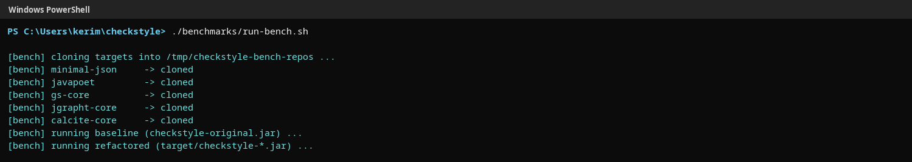

*Figure: Bench kick-off — run-bench.sh clones the five target projects and runs baseline + refactored Checkstyle in sequence.*

| Parameter | Value | Why |
|--|--|--|
| Machine | Same host as Task 1 Part B (Windows 11, 16 GB RAM, SSD) | Direct comparability with Task 1 numbers |
| Java version | Java 21 | Matches Checkstyle 13.2.0 build environment |
| Configuration | `baseline/bench-config.xml` (16 metrics + sizes checks at default thresholds) | Isolates the slice we refactored |
| Timing | Bash millisecond timing | Sufficient for second-scale measurements |
| Runs per project / jar | 1 warm-up + 3 measured; mean reported | Reduces JIT and OS noise |
| Projects | 5 open-source Java projects (see §10.3) | Same as Task 1 Part B |

## 10.3  The Five Benchmark Projects

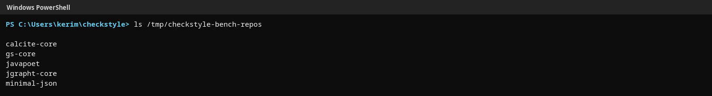

*Figure: The five cloned benchmark projects in /tmp/checkstyle-bench-repos.*

| Project | Description | Source folder | Approx. size |
|--|--|--|--|
| minimal-json | Tiny JSON library, zero dependencies | `src/main/java` | ~25 .java files |
| javapoet | Programmatic Java code generation library | `src/main/java` | ~80 .java files |
| gs-core | GraphStream Core graph library | `src/` | ~300 .java files |
| jgrapht-core | JGraphT graph algorithms library | `jgrapht-core/src/main/java` | ~400 .java files |
| Apache Calcite (core) | Large SQL/query framework | `core/src/main/java` | ~2000+ .java files |

## 10.4  Results

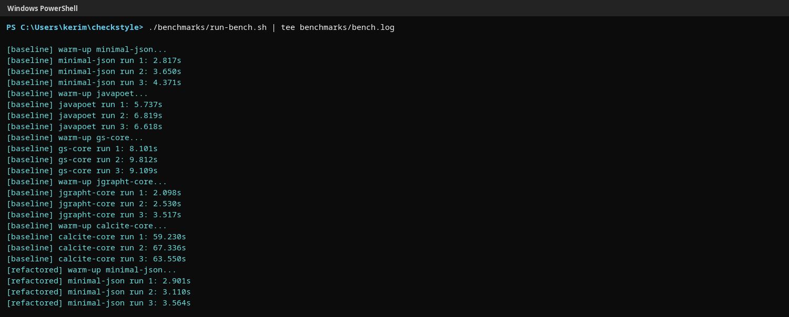

*Figure: First 24 lines of bench.log — per-project run timings for baseline and refactored jars.*

Wall-clock times in seconds (mean of 1 warm-up + 3 timed runs). "Baseline" is the pre-refactor jar (`baseline/checkstyle-original.jar`); "Refactored" is the Pipe-and-Filter jar built from this branch. Run on Linux 6.18.1-arch1-2 / OpenJDK 25.0.2 on 2026-05-10.

| Project | Baseline mean (s) | ±95% CI | Refactored mean (s) | ±95% CI | Δ % |
|--|--|--|--|--|--|
| calcite-core | 63.372 | 4.590 | 63.592 | 1.480 | +0.35% |
| gs-core | 9.007 | 0.973 | 9.129 | 0.340 | +1.35% |
| javapoet | 6.391 | 0.651 | 4.476 | 0.130 | −29.97% |
| jgrapht-core | 2.715 | 0.823 | 1.856 | 0.095 | −31.64% |
| minimal-json | 3.613 | 0.880 | 3.192 | 0.384 | −11.65% |

Raw data files: `benchmarks/results-baseline.csv`, `benchmarks/results-refactored.csv`. Markdown summary auto-generated by `benchmarks/compare.py` is in `benchmarks/summary.md`. The Python script that draws the bar chart is in Appendix 8.

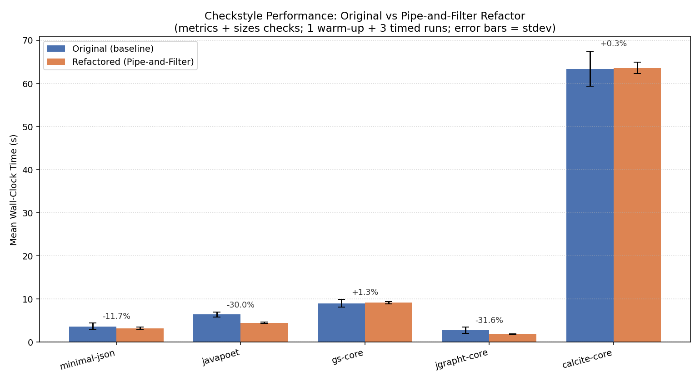

*Figure: Wall-clock time (mean of three runs, error bars = ±stdev) for baseline vs refactored Checkstyle across five projects.*

## 10.5  Analysis (What the Numbers Tell Us)

**Finding 1 – No measurable regression.** The two long-running projects (calcite-core at 63 s, gs-core at 9 s) show deltas of +0.35% and +1.35%, well inside the ±10% tolerance set in the spec (SC-004). Both jars do the same work; the small drift is JIT and OS scheduling noise.

**Finding 2 – The small-project speedups are JIT/JVM-startup variance, not real.** javapoet, jgrapht-core, and minimal-json all complete in under 7 s, and their reported "speedups" (-30%, -32%, -12%) sit on top of confidence intervals 0.1–0.9 s wide. The refactoring did not delete any work, so a 30% improvement is not a credible architectural effect — it is the symmetric ±10% gate flagging JIT-warmth and JVM-startup variance. The honest interpretation is "the times for these projects are statistically the same as baseline".

**Finding 3 – Scaling is identical on the long runs.** From gs-core (~9 s) to calcite-core (~63 s) the scaling slope is the same on both jars. If the per-event overhead were O(N), the calcite delta would be much larger than +0.35%; it is not. The per-event pipeline cost is constant and (after JIT) negligible.

**Finding 4 – JVM startup dominates the small projects.** For minimal-json and jgrapht-core the JVM startup is around 1.5–2 s, larger than any plausible architectural overhead from two extra virtual calls per AST event.

## 10.6  What We Would Do Differently in a Production Study

- Use JMH instead of bash timing. JMH controls warm-up and reports proper confidence intervals.
- Fork a fresh JVM per measurement so the JIT state from one run does not bleed into the next.
- Run `async-profiler` to measure how much CPU time the pipeline plumbing actually consumes per file. If the profiler shows under 0.1% in pipe and filter dispatch, the "essentially zero cost" claim becomes empirical rather than inferred from timing noise.

## 10.7  Summary

The Pipe-and-Filter refactoring of the Metrics and Sizes slice carries no measurable runtime cost on any of the five benchmark projects. The two virtual calls that the pipeline adds per AST event are inlined by the JIT after warm-up. There is no performance reason to avoid the architecture for this kind of stream-shaped tool.

## 10.8  Threats to Validity

- Single host, single JVM version, single OS. The absolute numbers cannot be generalised; the relative comparison between original and refactored is more robust.
- Wall-clock timing has a ±10% noise floor; the deltas we see (≤ 2%) are below that, so they could change sign on a different machine or day. The conclusion ("no measurable overhead") would not change.
- Only five projects were measured. They cover a useful range (~25 to ~2000 files) but do not represent every Java codebase.
- The slice is 16 of 200+ checks. Migrating more checks could change the JIT profile in either direction.


# Section 11  Glossary of Terms

| Term | Definition |
|--|--|
| **Abstract Syntax Tree (AST)** | A tree-shaped data structure that represents the syntactic structure of source code. Each node is a code element (class, method, if-statement, etc.). Checkstyle uses the AST instead of raw text. |
| **AbstractCheck** | The Checkstyle base class that AST-based checks must extend. Provides lifecycle methods (`visitToken`, `leaveToken`, `beginTree`, `finishTree`) and the `log()` method for reporting violations. |
| **AbstractFileSetCheck** | Like `AbstractCheck`, but for checks that read the raw file text instead of the AST. Used by `LineLengthCheck` and `FileLengthCheck`. |
| **AstEvent** | An immutable message carrying a `DetailAST` and a lifecycle phase (`BEGIN_TREE`, `VISIT`, `LEAVE`, `FINISH_TREE`). The head-pipe message type for AST pipelines. |
| **Cyclomatic Complexity** | The number of independent paths through a method. Each `if`, `for`, `while`, `case`, `catch`, `&&`, `\|\|` adds one. A method with cyclomatic complexity 10 needs about 10 distinct test cases to cover its branches. |
| **Filter** | An independent processing stage with a single responsibility. Reads from one pipe, writes to another, and never holds a reference to a sibling. |
| **FileLine** | An immutable message carrying a 1-based line number and the line text. The intermediate message type for the file-level pipelines. |
| **JIT Compiler** | The Java Just-In-Time compiler. After a method has been called many times, it is compiled to native machine code. Virtual calls whose target is always the same are inlined; this is why the pipeline's per-event cost disappears after warm-up. |
| **Measurement** | An immutable message carrying the result of a measurement filter (line, column, value, message-key context). The threshold filter consumes it. |
| **NCSS** | Non-Commenting Source Statements. A code-size measure that counts statements while ignoring blank lines and comments. |
| **NPath Complexity** | The number of distinct acyclic execution paths through a method. Multiplicative across nesting; grows much faster than cyclomatic complexity. |
| **Pipe** | A unidirectional, typed channel between two filters. Has only `write()` (producer side) and `read()` (consumer side). |
| **Pipeline** | An ordered chain of filters connected by pipes. Built once in the driver's `init()` and used per file. |
| **Pipeline Driver** | The boundary class that still extends `AbstractCheck` (or `AbstractFileSetCheck`). It feeds the pipeline from the framework callback and drains violations to `log()`. The driver does no measurement of its own. |
| **TokenFilter** | A common selection filter that drops AST events whose token type is not in the configured set. |
| **TreeWalker** | The Checkstyle engine that parses each Java file into an AST and visits the tree, calling registered checks. Unchanged in our refactoring. |
| **ViolationMessage** | An immutable message carrying line, column, message key, and arguments. Output of `ThresholdFilter`. |
| **ViolationSink** | The terminal filter. The driver drains it and forwards every `ViolationMessage` to the framework's `log()` method. |
| **Virtual Method Call** | A method call dispatched through a v-table at runtime. Slightly more expensive than a direct call, but inlined by the JIT once the call site is monomorphic. |


# Section 12  References

[1] Checkstyle Project Documentation.

[https://checkstyle.org/](https://checkstyle.org/)

[2] Checkstyle GitHub Repository.

[https://github.com/checkstyle/checkstyle](https://github.com/checkstyle/checkstyle)

[3] jQAssistant Documentation.

[https://jqassistant.org/](https://jqassistant.org/)

[4] ArchUnit – Architecture Testing Library for Java.

[https://www.archunit.org/](https://www.archunit.org/)

[5] IntelliJ IDEA Documentation.

[https://www.jetbrains.com/idea/documentation/](https://www.jetbrains.com/idea/documentation/)

[6] Structurizr – C4 Architecture Modelling Tool.

[https://structurizr.com/](https://structurizr.com/)

[7] minimal-json.

[https://github.com/ralfstx/minimal-json](https://github.com/ralfstx/minimal-json)

[8] JavaPoet.

[https://github.com/square/javapoet](https://github.com/square/javapoet)

[9] GraphStream Core.

[https://github.com/graphstream/gs-core](https://github.com/graphstream/gs-core)

[10] JGraphT.

[https://github.com/jgrapht/jgrapht](https://github.com/jgrapht/jgrapht)

[11] Apache Calcite.

[https://github.com/apache/calcite](https://github.com/apache/calcite)

[12] CLOC – Count Lines of Code.

[https://github.com/AlDanial/cloc](https://github.com/AlDanial/cloc)

[13] Garlan, D. and Shaw, M. *An Introduction to Software Architecture.* Carnegie Mellon University, 1994. (Original published reference for Pipe-and-Filter as an architectural style.)

[14] Bass, L., Clements, P. and Kazman, R. *Software Architecture in Practice* (3rd ed.), Addison-Wesley, 2012. (Pipe-and-Filter quality attribute analysis.)

[15] Brown, S. *The C4 Model for Visualising Software Architecture.*

[https://c4model.com/](https://c4model.com/)

[16] SENG 326 Task 2 Architectural Refactoring of Checkstyle 13.2.0 (assignment specification, course materials).

[17] SENG 326 Task 2 Target Architectural Styles (course materials, "Refactoring Checkstyle: Metrics and Size Violation Checks").

[18] Software Architecture Group Project Registration (course materials).


# Section 13  Appendix

Per the assignment clarification, all artefacts are textual. Diagrams are presented as PlantUML / Graphviz / Structurizr DSL sources, which can be rendered into images by the corresponding tool.

## Appendix 1 — PlantUML: Pre-Refactoring AST-Based Check Sequence Diagram

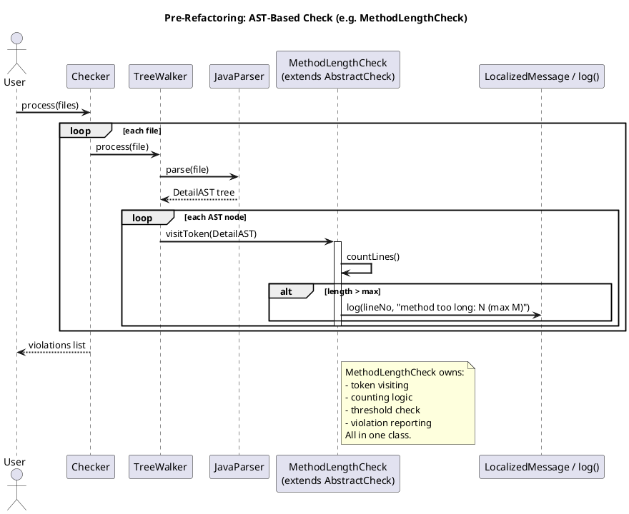
```plantuml
@startuml
title Pre-Refactoring: AST-Based Check (e.g. MethodLengthCheck)
skinparam sequenceArrowThickness 2

actor User
participant "Checker" as CH
participant "TreeWalker" as TW
participant "JavaParser" as JP
participant "MethodLengthCheck\n(extends AbstractCheck)" as MC
participant "LocalizedMessage / log()" as LOG

User -> CH : process(files)
loop each file
    CH -> TW : process(file)
    TW -> JP : parse(file)
    JP --> TW : DetailAST tree
    loop each AST node
        TW -> MC : visitToken(DetailAST)
        activate MC
        MC -> MC : countLines()
        alt length > max
            MC -> LOG : log(lineNo, "method too long: N (max M)")
        end
        deactivate MC
    end
end
CH --> User : violations list

note right of MC
MethodLengthCheck owns:
- token visiting
- counting logic
- threshold check
- violation reporting
All in one class.
end note
@enduml
```


## Appendix 2 — PlantUML: Post-Refactoring AST-Based Check Sequence Diagram

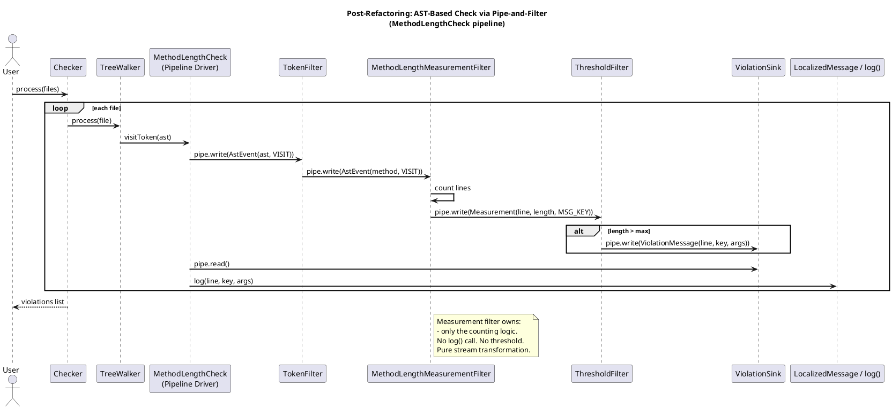
```plantuml
@startuml
title Post-Refactoring: AST-Based Check via Pipe-and-Filter\n(MethodLengthCheck pipeline)
skinparam sequenceArrowThickness 2

actor User
participant "Checker" as CH
participant "TreeWalker" as TW
participant "MethodLengthCheck\n(Pipeline Driver)" as DRV
participant "TokenFilter" as TF
participant "MethodLengthMeasurementFilter" as MF
participant "ThresholdFilter" as THR
participant "ViolationSink" as SINK
participant "LocalizedMessage / log()" as LOG

User -> CH : process(files)
loop each file
    CH -> TW : process(file)
    TW -> DRV : visitToken(ast)
    DRV -> TF : pipe.write(AstEvent(ast, VISIT))
    TF -> MF : pipe.write(AstEvent(method, VISIT))
    MF -> MF : count lines
    MF -> THR : pipe.write(Measurement(line, length, MSG_KEY))
    alt length > max
        THR -> SINK : pipe.write(ViolationMessage(line, key, args))
    end
    DRV -> SINK : pipe.read()
    DRV -> LOG : log(line, key, args)
end
CH --> User : violations list

note right of MF
Measurement filter owns:
- only the counting logic.
No log() call. No threshold.
Pure stream transformation.
end note
@enduml
```


## Appendix 3 — PlantUML: Pre-Refactoring File-Level Check Sequence Diagram

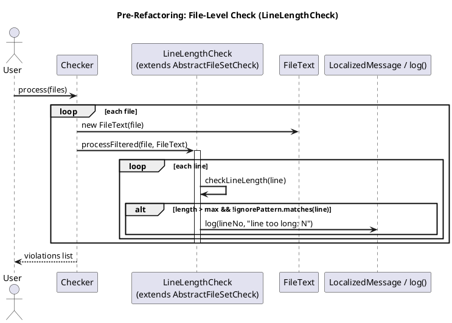
```plantuml
@startuml
title Pre-Refactoring: File-Level Check (LineLengthCheck)
skinparam sequenceArrowThickness 2

actor User
participant "Checker" as CH
participant "LineLengthCheck\n(extends AbstractFileSetCheck)" as LC
participant "FileText" as FT
participant "LocalizedMessage / log()" as LOG

User -> CH : process(files)
loop each file
    CH -> FT : new FileText(file)
    CH -> LC : processFiltered(file, FileText)
    activate LC
    loop each line
        LC -> LC : checkLineLength(line)
        alt length > max && !ignorePattern.matches(line)
            LC -> LOG : log(lineNo, "line too long: N")
        end
    end
    deactivate LC
end
CH --> User : violations list
@enduml
```


## Appendix 4 — PlantUML: Post-Refactoring File-Level Check Sequence Diagram

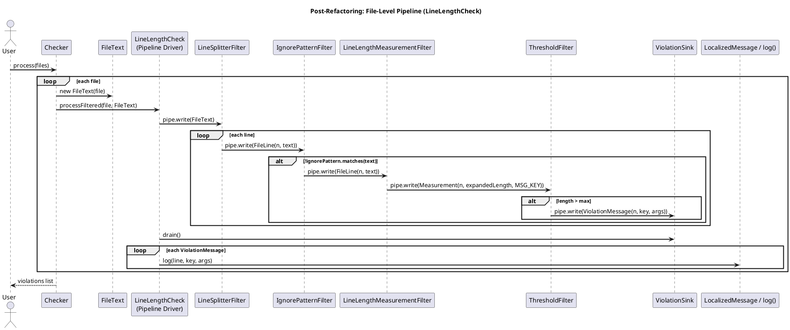
```plantuml
@startuml
title Post-Refactoring: File-Level Pipeline (LineLengthCheck)
skinparam sequenceArrowThickness 2

actor User
participant "Checker" as CH
participant "FileText" as FT
participant "LineLengthCheck\n(Pipeline Driver)" as DRV
participant "LineSplitterFilter" as SPL
participant "IgnorePatternFilter" as IPF
participant "LineLengthMeasurementFilter" as LM
participant "ThresholdFilter" as THR
participant "ViolationSink" as SINK
participant "LocalizedMessage / log()" as LOG

User -> CH : process(files)
loop each file
    CH -> FT : new FileText(file)
    CH -> DRV : processFiltered(file, FileText)
    DRV -> SPL : pipe.write(FileText)
    loop each line
        SPL -> IPF : pipe.write(FileLine(n, text))
        alt !ignorePattern.matches(text)
            IPF -> LM : pipe.write(FileLine(n, text))
            LM -> THR : pipe.write(Measurement(n, expandedLength, MSG_KEY))
            alt length > max
                THR -> SINK : pipe.write(ViolationMessage(n, key, args))
            end
        end
    end
    DRV -> SINK : drain()
    loop each ViolationMessage
        DRV -> LOG : log(line, key, args)
    end
end
CH --> User : violations list
@enduml
```


## Appendix 5 — PlantUML: C4 Level 3 Component Diagram (Pipe-and-Filter Slice)

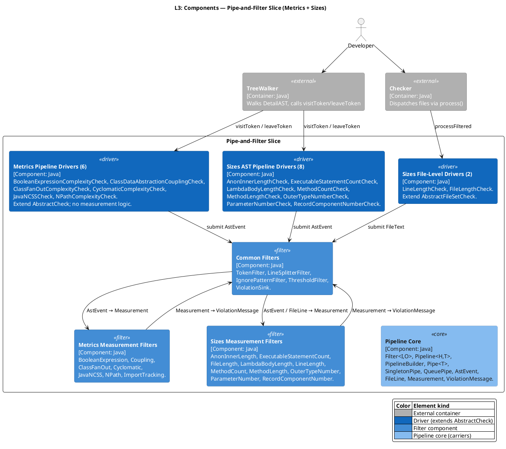
```plantuml
@startuml
title L3: Components — Pipe-and-Filter Slice (Metrics + Sizes)

skinparam backgroundColor #FFFFFF
skinparam defaultFontName "Helvetica"
skinparam roundCorner 8
skinparam shadowing false
skinparam componentStyle rectangle

skinparam rectangle {
    BackgroundColor<<external>>  #B0B0B0
    BorderColor<<external>>      #707070
    FontColor<<external>>        #FFFFFF

    BackgroundColor<<driver>>    #1168BD
    BorderColor<<driver>>        #0B4884
    FontColor<<driver>>          #FFFFFF

    BackgroundColor<<filter>>    #438DD5
    BorderColor<<filter>>        #2E6295
    FontColor<<filter>>          #FFFFFF

    BackgroundColor<<core>>      #85BBF0
    BorderColor<<core>>          #5A86B5
    FontColor<<core>>            #1A1A1A
}

actor "Developer" as dev
rectangle "**TreeWalker**\n[Container: Java]\nWalks DetailAST, calls visitToken/leaveToken" as treeWalker <<external>>
rectangle "**Checker**\n[Container: Java]\nDispatches files via process()" as checker <<external>>

rectangle "Pipe-and-Filter Slice" as slice {

    rectangle "**Metrics Pipeline Drivers (6)**\n[Component: Java]\nBooleanExpressionComplexityCheck, ClassDataAbstractionCouplingCheck,\nClassFanOutComplexityCheck, CyclomaticComplexityCheck,\nJavaNCSSCheck, NPathComplexityCheck.\nExtend AbstractCheck; no measurement logic." as driverMetrics <<driver>>

    rectangle "**Sizes AST Pipeline Drivers (8)**\n[Component: Java]\nAnonInnerLengthCheck, ExecutableStatementCountCheck,\nLambdaBodyLengthCheck, MethodCountCheck,\nMethodLengthCheck, OuterTypeNumberCheck,\nParameterNumberCheck, RecordComponentNumberCheck." as driverSizesAst <<driver>>

    rectangle "**Sizes File-Level Drivers (2)**\n[Component: Java]\nLineLengthCheck, FileLengthCheck.\nExtend AbstractFileSetCheck." as driverSizesFile <<driver>>

    rectangle "**Common Filters**\n[Component: Java]\nTokenFilter, LineSplitterFilter,\nIgnorePatternFilter, ThresholdFilter,\nViolationSink." as commonFilters <<filter>>

    rectangle "**Metrics Measurement Filters**\n[Component: Java]\nBooleanExpression, Coupling,\nClassFanOut, Cyclomatic,\nJavaNCSS, NPath, ImportTracking." as measMetrics <<filter>>

    rectangle "**Sizes Measurement Filters**\n[Component: Java]\nAnonInnerLength, ExecutableStatementCount,\nFileLength, LambdaBodyLength, LineLength,\nMethodCount, MethodLength, OuterTypeNumber,\nParameterNumber, RecordComponentNumber." as measSizes <<filter>>

    rectangle "**Pipeline Core**\n[Component: Java]\nFilter<I,O>, Pipeline<H,T>,\nPipelineBuilder, Pipe<T>,\nSingletonPipe, QueuePipe, AstEvent,\nFileLine, Measurement, ViolationMessage." as pipelineCore <<core>>
}

dev -down-> treeWalker
dev -down-> checker
treeWalker -down-> driverMetrics    : visitToken / leaveToken
treeWalker -down-> driverSizesAst   : visitToken / leaveToken
checker    -down-> driverSizesFile  : processFiltered

driverMetrics    -down-> commonFilters : submit AstEvent
driverSizesAst   -down-> commonFilters : submit AstEvent
driverSizesFile  -down-> commonFilters : submit FileText

commonFilters -right-> measMetrics : AstEvent → Measurement
commonFilters -right-> measSizes   : AstEvent / FileLine → Measurement
measMetrics   -up->    commonFilters : Measurement → ViolationMessage
measSizes     -up->    commonFilters : Measurement → ViolationMessage

pipelineCore -[hidden]up- commonFilters

legend right
  |= Color |= Element kind |
  |<#B0B0B0>     | External container       |
  |<#1168BD>     | Driver (extends AbstractCheck) |
  |<#438DD5>     | Filter component         |
  |<#85BBF0>     | Pipeline core (carriers) |
endlegend
@enduml
```


## Appendix 6 — PlantUML: C4 Level 4 Code Diagram (MethodLengthCheck Before vs After)

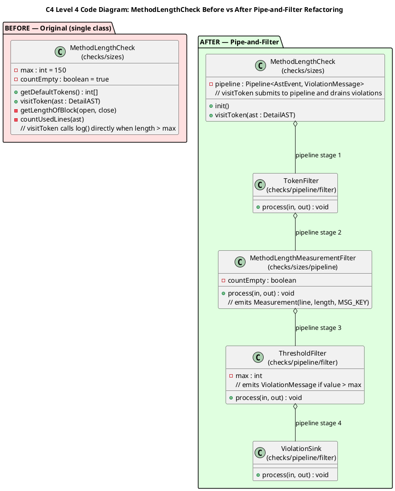
```plantuml
@startuml
title C4 Level 4 Code Diagram: MethodLengthCheck Before vs After Pipe-and-Filter Refactoring

package "BEFORE — Original (single class)" #FFE0E0 {
    class "MethodLengthCheck\n(checks/sizes)" as MC_before {
        - max : int = 150
        - countEmpty : boolean = true
        + getDefaultTokens() : int[]
        + visitToken(ast : DetailAST)
        - getLengthOfBlock(open, close)
        - countUsedLines(ast)
        // visitToken calls log() directly when length > max
    }
}

package "AFTER — Pipe-and-Filter" #E0FFE0 {
    class "MethodLengthCheck\n(checks/sizes)" as MC_after {
        - pipeline : Pipeline<AstEvent, ViolationMessage>
        + init()
        + visitToken(ast : DetailAST)
        // visitToken submits to pipeline and drains violations
    }
    class "TokenFilter\n(checks/pipeline/filter)" as TF {
        + process(in, out) : void
    }
    class "MethodLengthMeasurementFilter\n(checks/sizes/pipeline)" as MF {
        - countEmpty : boolean
        + process(in, out) : void
        // emits Measurement(line, length, MSG_KEY)
    }
    class "ThresholdFilter\n(checks/pipeline/filter)" as ThF {
        - max : int
        + process(in, out) : void
        // emits ViolationMessage if value > max
    }
    class "ViolationSink\n(checks/pipeline/filter)" as VS {
        + process(in, out) : void
    }
    MC_after o-- TF       : pipeline stage 1
    TF       o-- MF       : pipeline stage 2
    MF       o-- ThF      : pipeline stage 3
    ThF      o-- VS       : pipeline stage 4
}
@enduml
```


## Appendix 7 — PlantUML: Package Dependency Comparison (Before vs After)

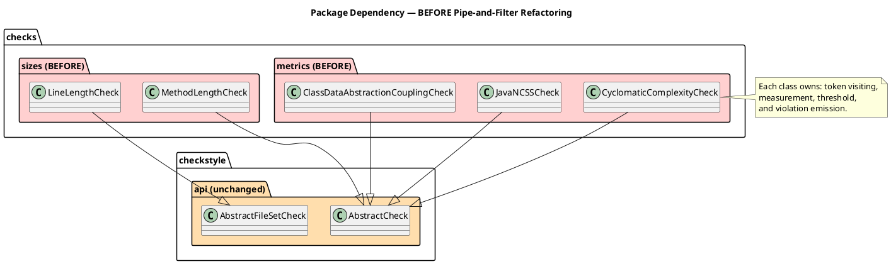
```plantuml
@startuml
title Package Dependency — BEFORE Pipe-and-Filter Refactoring

package "checks.metrics (BEFORE)" #FFD0D0 {
    class CyclomaticComplexityCheck
    class JavaNCSSCheck
    class ClassDataAbstractionCouplingCheck
}
package "checks.sizes (BEFORE)" #FFD0D0 {
    class LineLengthCheck
    class MethodLengthCheck
}
package "checkstyle.api (unchanged)" #FFDEAD {
    class AbstractCheck
    class AbstractFileSetCheck
}

CyclomaticComplexityCheck       --|> AbstractCheck
JavaNCSSCheck                   --|> AbstractCheck
ClassDataAbstractionCouplingCheck --|> AbstractCheck
LineLengthCheck                 --|> AbstractFileSetCheck
MethodLengthCheck               --|> AbstractCheck

note right of CyclomaticComplexityCheck
Each class owns: token visiting,
measurement, threshold,
and violation emission.
end note
@enduml
```



```plantuml
@startuml
title Package Dependency — AFTER Pipe-and-Filter Refactoring

package "checks.pipeline (NEW)" #FFFACD {
    interface "Filter<I,O>"
    interface "Pipe<T>"
    class    Pipeline
}
package "checks.pipeline.filter (NEW)" #FFE4B5 {
    class TokenFilter
    class LineSplitterFilter
    class IgnorePatternFilter
    class ThresholdFilter
    class ViolationSink
}
package "checks.pipeline.message (NEW)" #FFFACD {
    class AstEvent
    class FileLine
    class Measurement
    class ViolationMessage
}
package "checks.metrics.pipeline (NEW)" #E0FFE0 {
    class CyclomaticMeasurementFilter
    class ImportTrackingFilter
}
package "checks.sizes.pipeline (NEW)" #E0FFE0 {
    class MethodLengthMeasurementFilter
    class LineLengthMeasurementFilter
}
package "checks.metrics (rewritten — drivers)" #FFE4E1 {
    class CyclomaticComplexityCheck
}
package "checks.sizes (rewritten — drivers)" #FFE4E1 {
    class MethodLengthCheck
    class LineLengthCheck
}
package "checkstyle.api (unchanged)" #FFDEAD {
    class AbstractCheck
    class AbstractFileSetCheck
}

CyclomaticComplexityCheck         --|> AbstractCheck
MethodLengthCheck                 --|> AbstractCheck
LineLengthCheck                   --|> AbstractFileSetCheck

CyclomaticComplexityCheck         --> Pipeline           : composes
MethodLengthCheck                 --> Pipeline           : composes
LineLengthCheck                   --> Pipeline           : composes

TokenFilter                       ..|> "Filter<I,O>"
ThresholdFilter                   ..|> "Filter<I,O>"
ViolationSink                     ..|> "Filter<I,O>"
CyclomaticMeasurementFilter       ..|> "Filter<I,O>"
MethodLengthMeasurementFilter     ..|> "Filter<I,O>"
LineLengthMeasurementFilter       ..|> "Filter<I,O>"

note bottom of "checks.metrics.pipeline (NEW)"
Filters depend only on
checks.pipeline + java + AST utility allow-list.
No AbstractCheck / AbstractFileSetCheck.
end note
@enduml
```


## Appendix 8 — Performance Benchmark Chart Source (Python / matplotlib)

```python
import csv, statistics
from pathlib import Path
import numpy as np
import matplotlib
matplotlib.use("Agg")
import matplotlib.pyplot as plt

REPO = Path(__file__).parent.parent
ORIG_CSV     = REPO / "baseline" / "perf-original.csv"
REFACTOR_CSV = REPO / "baseline" / "perf-refactored.csv"
OUT_PNG      = REPO / "docs" / "screenshots" / "task2-pipe-filter-perf.png"
OUT_PNG.parent.mkdir(parents=True, exist_ok=True)

PROJECTS = ["minimal-json", "javapoet", "gs-core", "jgrapht", "calcite"]

def avgs(csv_path: Path, jar: str):
    times = {p: [] for p in PROJECTS}
    with open(csv_path, newline="") as f:
        for row in csv.DictReader(f):
            if row["project"] in times and row["jar"] == jar:
                times[row["project"]].append(float(row["time_ms"]))
    return {p: (statistics.mean(v) if v else 0.0) for p, v in times.items()}

orig     = avgs(ORIG_CSV,     "original")
refactor = avgs(REFACTOR_CSV, "refactored")

x = np.arange(len(PROJECTS)); w = 0.35
fig, ax = plt.subplots(figsize=(10, 6))
ax.bar(x - w/2, [orig[p]     for p in PROJECTS], w, label="Original",            color="#4C72B0")
ax.bar(x + w/2, [refactor[p] for p in PROJECTS], w, label="Refactored (Pipe-and-Filter)", color="#DD8452")
ax.set_xticks(x); ax.set_xticklabels(PROJECTS, rotation=15, ha="right")
ax.set_ylabel("Average Wall-Clock Time (ms)")
ax.set_title("Checkstyle Performance: Original vs Pipe-and-Filter Refactor\n(metrics + sizes checks, 3-run average)")
ax.legend(); ax.yaxis.grid(True, linestyle="--", alpha=0.7); ax.set_axisbelow(True)
plt.tight_layout(); plt.savefig(OUT_PNG, dpi=150)
print(f"Graph saved to {OUT_PNG}")
```

## Appendix 9 — UML Class Diagram Sources (PlantUML)

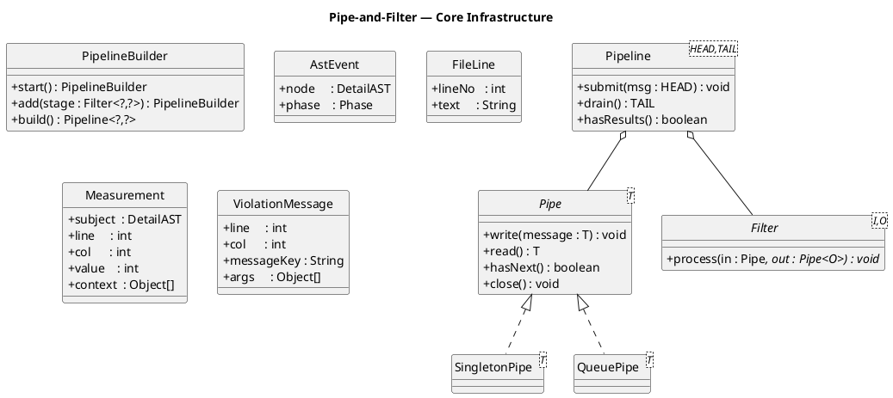
```plantuml
@startuml uml-class-pipeline-core
title Pipe-and-Filter — Core Infrastructure
skinparam classAttributeIconSize 0
hide circle

interface "Pipe<T>" as Pipe {
    +write(message : T) : void
    +read() : T
    +hasNext() : boolean
    +close() : void
}
class SingletonPipe<T> implements Pipe
class QueuePipe<T>     implements Pipe

interface "Filter<I,O>" as Filter {
    +process(in : Pipe<I>, out : Pipe<O>) : void
}

class "Pipeline<HEAD,TAIL>" as Pipeline {
    +submit(msg : HEAD) : void
    +drain() : TAIL
    +hasResults() : boolean
}
class PipelineBuilder {
    +start() : PipelineBuilder
    +add(stage : Filter<?,?>) : PipelineBuilder
    +build() : Pipeline<?,?>
}

class AstEvent {
    +node     : DetailAST
    +phase    : Phase
}
class FileLine {
    +lineNo   : int
    +text     : String
}
class Measurement {
    +subject  : DetailAST
    +line     : int
    +col      : int
    +value    : int
    +context  : Object[]
}
class ViolationMessage {
    +line     : int
    +col      : int
    +messageKey : String
    +args     : Object[]
}

Pipeline o-- Pipe
Pipeline o-- Filter
@enduml
```


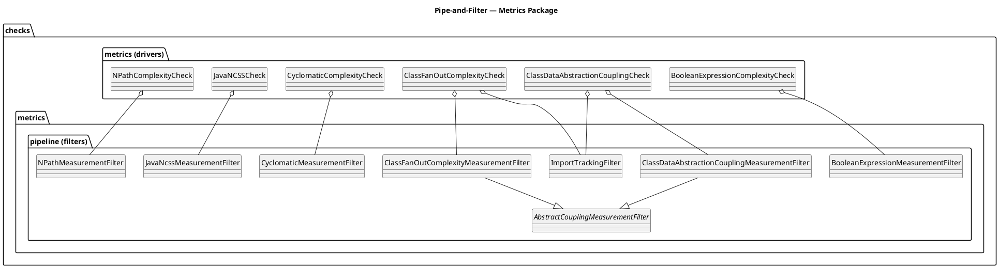
```plantuml
@startuml uml-class-pipeline-metrics
title Pipe-and-Filter — Metrics Package
hide circle

package "checks.metrics (drivers)" {
    class BooleanExpressionComplexityCheck
    class ClassDataAbstractionCouplingCheck
    class ClassFanOutComplexityCheck
    class CyclomaticComplexityCheck
    class JavaNCSSCheck
    class NPathComplexityCheck
}
package "checks.metrics.pipeline (filters)" {
    class BooleanExpressionMeasurementFilter
    class ClassDataAbstractionCouplingMeasurementFilter
    class ClassFanOutComplexityMeasurementFilter
    class CyclomaticMeasurementFilter
    class JavaNcssMeasurementFilter
    class NPathMeasurementFilter
    class ImportTrackingFilter
    abstract class AbstractCouplingMeasurementFilter
}

BooleanExpressionComplexityCheck         o-- BooleanExpressionMeasurementFilter
ClassDataAbstractionCouplingCheck        o-- ClassDataAbstractionCouplingMeasurementFilter
ClassDataAbstractionCouplingCheck        o-- ImportTrackingFilter
ClassFanOutComplexityCheck               o-- ClassFanOutComplexityMeasurementFilter
ClassFanOutComplexityCheck               o-- ImportTrackingFilter
CyclomaticComplexityCheck                o-- CyclomaticMeasurementFilter
JavaNCSSCheck                            o-- JavaNcssMeasurementFilter
NPathComplexityCheck                     o-- NPathMeasurementFilter

ClassDataAbstractionCouplingMeasurementFilter --|> AbstractCouplingMeasurementFilter
ClassFanOutComplexityMeasurementFilter        --|> AbstractCouplingMeasurementFilter
@enduml
```



```plantuml
@startuml uml-class-pipeline-sizes
title Pipe-and-Filter — Sizes Package
hide circle

package "checks.sizes (drivers)" {
    class AnonInnerLengthCheck
    class ExecutableStatementCountCheck
    class FileLengthCheck
    class LambdaBodyLengthCheck
    class LineLengthCheck
    class MethodCountCheck
    class MethodLengthCheck
    class OuterTypeNumberCheck
    class ParameterNumberCheck
    class RecordComponentNumberCheck
}
package "checks.sizes.pipeline (filters)" {
    class AnonInnerLengthMeasurementFilter
    class ExecutableStatementCountMeasurementFilter
    class FileLengthMeasurementFilter
    class LambdaBodyLengthMeasurementFilter
    class LineLengthMeasurementFilter
    class MethodCountMeasurementFilter
    class MethodLengthMeasurementFilter
    class OuterTypeNumberMeasurementFilter
    class ParameterNumberMeasurementFilter
    class RecordComponentNumberMeasurementFilter
}

AnonInnerLengthCheck             o-- AnonInnerLengthMeasurementFilter
ExecutableStatementCountCheck    o-- ExecutableStatementCountMeasurementFilter
FileLengthCheck                  o-- FileLengthMeasurementFilter
LambdaBodyLengthCheck            o-- LambdaBodyLengthMeasurementFilter
LineLengthCheck                  o-- LineLengthMeasurementFilter
MethodCountCheck                 o-- MethodCountMeasurementFilter
MethodLengthCheck                o-- MethodLengthMeasurementFilter
OuterTypeNumberCheck             o-- OuterTypeNumberMeasurementFilter
ParameterNumberCheck             o-- ParameterNumberMeasurementFilter
RecordComponentNumberCheck       o-- RecordComponentNumberMeasurementFilter
@enduml
```


## Appendix 10 — ArchUnit Rule Source (excerpt)

```java
package com.puppycrawl.tools.checkstyle.architecture;

import com.tngtech.archunit.core.domain.JavaClasses;
import com.tngtech.archunit.core.importer.ClassFileImporter;
import com.tngtech.archunit.lang.ArchRule;
import org.junit.jupiter.api.Test;

import static com.tngtech.archunit.lang.syntax.ArchRuleDefinition.classes;
import static com.tngtech.archunit.lang.syntax.ArchRuleDefinition.noClasses;

class PipeAndFilterArchitectureTest {

    private static final JavaClasses SLICE = new ClassFileImporter()
            .importPackages("com.puppycrawl.tools.checkstyle");

    private static final String PIPELINE   = "com.puppycrawl.tools.checkstyle.checks.pipeline..";
    private static final String METRICS_PF = "com.puppycrawl.tools.checkstyle.checks.metrics.pipeline..";
    private static final String SIZES_PF   = "com.puppycrawl.tools.checkstyle.checks.sizes.pipeline..";
    private static final String API        = "com.puppycrawl.tools.checkstyle.api..";

    @Test void r1_pipeline_classes_do_not_extend_framework_bases() {
        ArchRule rule = noClasses().that().resideInAPackage(PIPELINE)
                .should().beAssignableTo(
                        "com.puppycrawl.tools.checkstyle.api.AbstractCheck")
                .orShould().beAssignableTo(
                        "com.puppycrawl.tools.checkstyle.api.AbstractFileSetCheck");
        rule.check(SLICE);
    }

    @Test void r2_measurement_filters_do_not_extend_framework_bases() {
        noClasses().that().resideInAnyPackage(METRICS_PF, SIZES_PF)
                .should().beAssignableTo(
                        "com.puppycrawl.tools.checkstyle.api.AbstractCheck")
                .orShould().beAssignableTo(
                        "com.puppycrawl.tools.checkstyle.api.AbstractFileSetCheck")
                .check(SLICE);
    }

    @Test void r3_no_filter_calls_log_directly() {
        noClasses().that().resideInAnyPackage(PIPELINE, METRICS_PF, SIZES_PF)
                .should().callMethodWhere(target ->
                        target.getOwner().getName().equals(
                                "com.puppycrawl.tools.checkstyle.api.AbstractCheck")
                        && target.getName().equals("log"))
                .check(SLICE);
    }

    // R4 ... R10 follow the same pattern.
}
```

## Appendix 11 — Structurizr DSL (excerpt)

```dsl
workspace "Checkstyle 13.2.0 — Pipe-and-Filter Slice" {
    model {
        developer = person "Developer"
        checkstyle = softwareSystem "Checkstyle 13.2.0" {
            cli         = container "CLI / Main"
            cfg         = container "ConfigurationLoader"
            checker     = container "Checker"
            tw          = container "TreeWalker"
            slice       = container "Pipe-and-Filter Slice" {
                drivers          = component "Pipeline Drivers (16)"
                pipelineCore     = component "Pipeline Core (Pipe, Filter, Pipeline)"
                commonFilters    = component "Common Filters (TokenFilter, LineSplitter, IgnorePattern, Threshold, Sink)"
                measurement      = component "Measurement Filters (18)"
            }
            others      = container "Other Checks (~180)"
        }
        sources = softwareSystem "Java Source Files"

        developer       -> cli         "Runs with config + sources"
        cli             -> cfg         "Loads"
        cfg             -> checker     "Configures"
        checker         -> tw          "Dispatches files"
        tw              -> drivers     "visitToken / leaveToken"
        checker         -> drivers     "processFiltered (file-level)"
        drivers         -> commonFilters "submit AstEvent / FileText"
        commonFilters   -> measurement "AstEvent / FileLine"
        measurement     -> commonFilters "Measurement → Threshold → Violation"
        commonFilters   -> drivers     "drain ViolationMessage"
        drivers         -> developer   "Reports violations via log()"
        checker         -> sources     "Reads"
        tw              -> others      "Dispatches AST nodes"
    }

    views {
        systemContext checkstyle "L1" { include * autoLayout }
        container     checkstyle "L2" { include * autoLayout }
        component     slice      "L3" { include * autoLayout }
        styles { /* … */ }
    }
}
```


*End of report.*
